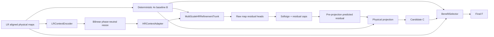

# NSAMDR production workflow

## Goal

**NSAMDR** means **Neural Structure-Aware Material Detail Reconstruction**.

The goal is to reconstruct EVE ship material textures at **4x** from lower-resolution
authored maps. The result must preserve the original art direction and physical-map
alignment.

NSAMDR must:

- remove interpolation blur and pixel stair-stepping;
- recover crisp manufactured seams, panel boundaries, and contours;
- recover evidence-supported high-frequency hull detail;
- reconstruct aligned albedo, normal, and material behaviour;
- preserve regions that deterministic reconstruction already gets right;
- avoid unsupported texture invention;
- fall back to the deterministic result when the learned result is worse.

[](./EXAMPLE.png)

`EXAMPLE.png` is the visual target. The final texture must look like a credible
higher-resolution version of the authored EVE asset. It must not look like a generic
sharpen filter or invented artwork.

---

## Quick start

From the Trinity repository root:

```bat
scripts\build\nsamdr.bat gui
```

The current production-development path is **V14.3 stable multi-scale phase-neutral
HR-first SR**.

---

## 1. A / B / C / F contract

All learned reconstruction is judged against a deterministic 4x baseline from the same LR
evidence.

- **A — authored target**: genuine authored high-resolution EVE pixels. A is available
  only during training and qualification.
- **B — deterministic baseline**: bicubic albedo, normalized bilinear normal XY, and
  nearest-neighbour material channels.
- **C — SR candidate**: learned 4x residual reconstruction over B.
- **F — final output**: local BenefitSelector result between B and C.

The production relationship is:

```text
C = project(B + predicted residual)
F = B + selector * (C - B)
```

C must materially improve B. The selector cannot hide a poor C and make the experiment
pass.

For regions where B is already correct:

```text
protectedPreservationRate >= 0.990
```

---

## 2. Why V14.3 exists

V14.0 used a learned 4x sub-pixel path. It produced too much LR-grid structure.

V14.1 removed PixelShuffle. It moved LR context into HR coordinates with bilinear resize
and an HR convolution. This reduced LR-lattice excess to approximately 7% in Capacity.
V14.1 still failed the edge gate at 58.02% against 60%.

V14.2 replaced the small HR trunk with a deeper three-scale RCAN-style reconstruction
network. The first Capacity run did not provide a valid capacity result. The optimizer
collapsed into a saturated state. Normal residual saturation approached 100%, material
saturation also became extreme, and the total gradient norm became zero for the remainder
of the run.

V14.3 keeps the V14.2 model capacity. It changes the optimization path so Capacity can test
that model correctly.

V14.3 adds:

- identity initialization for each RCAB residual branch;
- identity initialization for each ResidualGroup branch;
- raw zero-initialized physical-map heads;
- `softsign` residual bounding instead of `tanh`;
- direct residual supervision before albedo/material clamp and normal normalization;
- explicit Capacity divergence detection;
- `best_checkpoint.pt`, `last_stable_checkpoint.pt`, and `divergence_report.json`.

V14.3 does **not** change:

```text
Capacity maximum steps = 3072
Capacity learning rate = 0.001
global gate             = 45%
edge gate               = 60%
gradient gate           = 35%
lattice gate            = 15%
```

---

## 3. V14.3 production architecture

### 3.1 Top-level graph



The critical invariant is:

> **LR evidence can condition reconstruction, but it cannot own fixed 4x output phases.**

The candidate path contains no `PixelShuffle` and no `ConvTranspose2d`.

All learned decoder resizing uses:

```text
bilinear resize
+
normal HR convolution
```

### 3.2 Multi-scale HR reconstruction

```text
B physical maps + HR context
            |
            v
       HR stem, 48 ch
            |
            v
  HR ResidualGroup, 4 RCAB
            |
            +------------------------------ HR skip
            |
            v
     stride-2 downsample
            |
            v
  1/2 ResidualGroup, 64 ch, 4 RCAB
            |
            +------------------------------ 1/2 skip
            |
            v
     stride-2 downsample
            |
            v
  1/4 ResidualGroup, 96 ch, 6 RCAB
            |
            v
  Bottleneck ResidualGroup, 96 ch, 6 RCAB
            |
            v
 bilinear x2 + 3x3 adapter + 1/2 skip fuse
            |
            v
  1/2 decoder ResidualGroup, 64 ch, 4 RCAB
            |
            v
 bilinear x2 + 3x3 adapter + HR skip fuse
            |
            v
   HR decoder ResidualGroup, 48 ch, 4 RCAB
            |
            +------------------------------ global HR stem skip
            |
            v
       shared HR features
        /       |       \
       v        v        v
   albedo    normal   material
    tail      tail      tail
  2 RCAB    2 RCAB    2 RCAB
     |         |          |
 ZeroHead   ZeroHead   ZeroHead
     |         |          |
     +---------+----------+
               |
               v
        raw residual values
```

The lower-resolution feature levels increase the receptive field. They do not directly
generate output pixels.

### 3.3 Identity-safe residual initialization

Each RCAB has this structure:

```text
input
  |
  +-----------------------------+
  |                             |
  v                             |
3x3 convolution                 |
GELU                            |
3x3 convolution, zero init      |
channel attention               |
  |                             |
  +------ scaled residual ------+
```

Therefore:

```text
RCAB(x) == x
```

at initialization.

Each `ResidualGroup` also has a zero-initialized final 3x3 convolution. Therefore:

```text
ResidualGroup(x) == x
```

at initialization.

The deep network starts as an identity hierarchy instead of an arbitrary high-amplitude
residual transform.

### 3.4 Stable residual bounding

Each map tail returns an unconstrained raw residual. It does not apply `tanh`.

The production composition applies:

```text
bounded = softsign(raw) * residualCap
softsign(x) = x / (1 + abs(x))
```

The configured caps remain:

```text
albedo   = 0.40
normal   = 0.20
material = 0.25
```

The bounded result is named the **predicted residual**.

The physical candidate is then produced as:

```text
albedo C   = clamp(B + predicted residual, 0, 1)
normal C   = normalize_xy(B + predicted residual)
material C = clamp(B + predicted residual, 0, 1)
```

The zero-initialized heads preserve:

```text
before training:

raw residual       = 0
predicted residual = 0
C                   = B
```

### 3.5 Pre-projection residual supervision

Direct residual loss uses:

```text
predicted residual
```

before albedo/material clamp or normal normalization.

The target remains the capped authored correction:

```text
clamp(A - B, -residualCap, +residualCap)
```

This separation is important.

The reconstruction losses still evaluate physical candidate C. The direct residual loss
no longer depends on the post-projection value `C - B`. Therefore, a valid physical clamp
cannot remove the only useful gradient for the residual predictor.

---

## 4. OOP ownership

The V14.3 production implementation is under:

```text
tools/nsamdr/neural/v14/
```

### `config.py`

`V14Config` owns model dimensions, block counts, training geometry, residual caps,
qualification thresholds, and production tiling configuration.

The model schema is:

```text
NSAMDR_HR_FIRST_MULTI_MAP_SR_4X_V14_3
```

V14.2 and older checkpoints are incompatible.

### `refinement.py`

This file owns reconstruction components:

```text
ChannelAttention
RCAB
ResidualGroup
DownsampleFeatures
UpsampleAndFuse
PhysicalMapTail
MultiScaleHRRefinementTrunk
ZeroHead
```

### `model.py`

This file owns production composition:

```text
LRContextEncoder
HRContextAdapter
MultiScaleHRRefinementTrunk
BenefitSelector
NSAMDRV14
```

It also owns the softsign residual bounding and physical projection order.

### `losses.py`

This file owns candidate and selector objectives. Candidate residual supervision uses the
bounded pre-projection residual.

### `training_stability.py`

`DivergenceMonitor` owns Capacity stability detection. It does not change gradients,
optimizer values, or qualification thresholds.

### `capacity_artifacts.py`

`CapacityArtifactWriter` owns Capacity images and residual-cap telemetry.

### `capacity_diagnostic.py`

`CapacityDiagnostic` owns one complete Capacity run and checkpoint/report lifecycle.

The diagnostic uses the exact production candidate path. It does not define a special SR
network.

---

## 5. Capacity divergence contract

Capacity now has three possible outcomes:

```text
PASS
FAIL
DIVERGED
```

`DIVERGED` is separate from `FAIL`.

A run diverges if one of these conditions occurs:

- loss becomes non-finite;
- gradient norm becomes non-finite;
- total gradient becomes zero for three consecutive reports after learning has started;
- any bounded residual map remains at or above 95% cap saturation for three consecutive
  reports.

A divergence result can never count as Capacity PASS.

The run writes:

```text
best_checkpoint.pt
last_stable_checkpoint.pt
divergence_report.json          # only when DIVERGED
capacity_curve.json
report.json
ABCF_probe.png
edge_comparison.png
error_comparison.png
detail_band_comparison.png
```

`best_checkpoint.pt` and `last_stable_checkpoint.pt` are diagnostic artifacts only. They
cannot promote a production final.

---

## 6. Gradient checkpointing

V14.3 uses activation checkpointing at `ResidualGroup` boundaries during candidate
training.

Checkpointing is not applied to each convolution.

The purpose is to keep the `128 -> 512` training geometry while controlling HR activation
memory.

Checkpointing is disabled during evaluation and inference.

---

## 7. Native authored resolution

Training truth must come from the highest genuine native authored semantic map available.
A lower-resolution texture must not be enlarged and then used as new HR truth.

Examples:

```text
native 4096 asset -> supervise 1024 -> 4096
native 2048 asset -> supervise  512 -> 2048
native 1024 asset -> supervise  256 -> 1024
```

The current Raven Navy Issue semantic material set is native **1024x1024**.

Raven can provide genuine:

```text
256 -> 1024
```

supervision.

It cannot provide genuine:

```text
1024 -> 4096
```

supervision.

Production still applies the common 4x model as:

```text
native EVE 1024 -> NSAMDR 4096
```

---

## 8. Training geometry and curriculum

V14.3 Quick uses:

```text
training crop      : 128 LR -> 512 HR
held-out crop      : 128 LR -> 512 HR
native Raven check : 256 LR -> 1024 HR when native 1K maps are available
production         : 1024 LR -> 4096 HR through tiled inference
```

The SR curriculum remains:

1. **clean SR**;
2. **robust SR**;
3. **BenefitSelector**, only after C passes candidate qualification.

---

## 9. Candidate objective

C is trained with:

- direct albedo reconstruction;
- gradient reconstruction;
- Laplacian/high-frequency reconstruction;
- multiscale reconstruction;
- direct pre-projection residual supervision against `A - B`;
- aligned normal reconstruction;
- aligned material reconstruction.

There is no candidate-preservation loss whose easiest solution is `C ~= B`.

Hard final safety remains the BenefitSelector's responsibility.

---

## 10. LR-lattice rejection

Blockiness remains a qualification failure.

NSAMDR compares the cell-constant 4x projection of `C - B` with the same measurement for
`A - B`. The measurement checks every possible 4x lattice phase.

The current maximum remains:

```text
max excess LR-lattice cell projection <= 15%
```

V14.3 does not relax this limit.

---

## 11. Capacity gates and telemetry

Capacity pass or fail still uses only:

```text
global recovery   >= 45%
edge recovery     >= 60%
gradient recovery >= 35%
lattice excess    <= 15%
```

Additional telemetry does not affect pass or fail:

```text
1-pixel detail recovery
2-pixel detail recovery
4-pixel detail recovery
albedo recovery
normal recovery
material recovery
albedo residual-cap saturation
normal residual-cap saturation
material residual-cap saturation
gradient norm before clipping
peak allocated VRAM
peak reserved VRAM
```

---

## 12. Diagnostic ladder

### 1. V14.3 HR Residual Capacity

```text
one deterministic high-detail Raven region
128 -> 512
maximum 3072 steps
learning rate 0.001
```

The stage must return PASS before Multi-Region can run.

### 2. V14.3 Multi-Region SR Mini

This stage tests whether local reconstruction capacity generalizes to disjoint Raven
regions.

### 3. V14.3 Selector Retention Mini

This stage freezes a passing candidate. Only BenefitSelector trains.

### 4. V14.3 Raven Quick

This is the first promotable experiment. It performs representative held-out
qualification.

---

## 13. Qualification

Only fixed disjoint held-out crop records count toward candidate pass or fail. At least
**4 independent held-out samples** are required.

| Requirement | Threshold |
| --- | ---: |
| Independent held-out samples | >= 4 |
| Median candidate edge recovery | >= 60% |
| Median candidate global recovery | >= 45% |
| Median candidate gradient recovery | >= 35% |
| Positive-edge patch fraction | >= 75% |
| Positive-global patch fraction | >= 75% |
| Median normal recovery | >= 0% |
| Median material recovery | >= 0% |
| Worst candidate recovery | >= -10% |
| Max excess LR-lattice cell projection | <= 15% |

Only after C passes does the selector train.

Final qualification also requires:

| Requirement | Threshold |
| --- | ---: |
| Selector edge retention | >= 90% |
| Selector global retention | >= 90% |
| Median final normal recovery | >= 0% |
| Median final material recovery | >= 0% |
| Protected-B preservation | >= 99% |
| Worst final recovery | >= -10% |
| Max excess LR-lattice cell projection | <= 15% |

---

## 14. Quick and Full invariant

Raven Quick and Full Training must use the same:

- V14.3 production model;
- module graph;
- deterministic 4x baseline;
- candidate objective;
- selector behaviour;
- tiled inference implementation;
- checkpoint schema;
- qualification and provenance contract.

They can differ only in work budget and dataset scale.

Full Training remains disabled until V14.3 Raven Quick qualifies.

When Full is enabled, it must prefer the highest-native-resolution EVE semantic families
available. Genuine 4K families are especially important because they directly supervise:

```text
1024 -> 4096
```

---

## 15. Checkpoint and provenance

A qualified experiment promotes one checkpoint to:

```text
checkpoints/final/nsamdr_v14.pt
```

The final manifest records the SHA-256 and model schema.

The checkpoint must strict-load into a fresh V14.3 model before preview or baking.

No post-model repair, hidden sharpening, or candidate cleanup is permitted.

---

## 16. Production inference

For Raven:

```text
1024 native LR physical maps
        -> overlapping 128 LR tiles
        -> V14.3 512 HR tile reconstruction
        -> overlap blend
        -> 4096 final physical maps
```

The same model code and weights are used in diagnostics, Quick, qualification, and
production inference.

---

## 17. Commands

```bat
scripts\build\nsamdr.bat gui
scripts\build\nsamdr.bat raven-quick
scripts\build\nsamdr.bat preview EXP_####
scripts\build\nsamdr.bat validate
```

---

## 18. Completion condition

The project is not complete because one metric is green.

The project is not complete because the selector can hide a bad candidate.

The completion condition is:

> **Given representative held-out EVE authored textures, NSAMDR FINAL must look
> materially closer to the authored high-resolution target than deterministic 4x B,
> while it preserves already-correct regions and aligned physical-map behaviour.**

The immediate V14.3 milestone is:

```text
run the unchanged Capacity test with the stabilized V14.2 model capacity

PASS     -> freeze candidate architecture and continue to Multi-Region
FAIL     -> treat the result as a genuine capacity failure
DIVERGED -> correct the remaining numerical fault before changing model capacity
```
