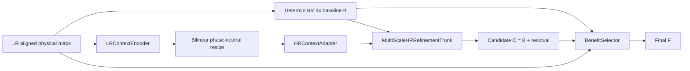

# NSAMDR production workflow

## Goal

**NSAMDR** means **Neural Structure-Aware Material Detail Reconstruction**.

The goal is to reconstruct EVE ship material textures at **4x** from lower-resolution
authored maps. The result must preserve the original art direction and physical-map
alignment.

NSAMDR must:

- remove interpolation blur and pixel stair-stepping;
- recover crisp manufactured seams, panel boundaries, and contours;
- recover evidence-supported high-frequency hull detail;
- reconstruct aligned albedo, normal, and material behaviour;
- preserve regions that deterministic reconstruction already gets right;
- avoid unsupported texture invention;
- fall back to the deterministic result when the learned result is worse.

[](./EXAMPLE.png)

`EXAMPLE.png` is the visual target. The final texture must look like a credible
higher-resolution version of the authored EVE asset. It must not look like a generic
sharpen filter or invented artwork.

---

## Quick start

From the Trinity repository root:

```bat
scripts\build\nsamdr.bat gui
```

The current production-development path is **V14.2 multi-scale phase-neutral HR-first SR**.

---

## 1. A / B / C / F contract

All learned reconstruction is judged against a deterministic 4x baseline from the same LR
evidence.

- **A — authored target**: genuine authored high-resolution EVE pixels. A is available
  only during training and qualification.
- **B — deterministic baseline**: bicubic albedo, normalized bilinear normal XY, and
  nearest-neighbour material channels.
- **C — SR candidate**: learned 4x residual reconstruction over B.
- **F — final output**: local BenefitSelector result between B and C.

The production relationship is:

```text
C = B + learned HR residual
F = B + selector * (C - B)
```

C must materially improve B. The selector cannot hide a poor C and make the experiment
pass.

For regions where B is already correct:

```text
protectedPreservationRate >= 0.990
```

---

## 2. Why V14.2 exists

V14.0 used a learned 4x sub-pixel path. It improved B, but it produced too much LR-grid
structure.

V14.1 removed PixelShuffle. It moved LR context into HR coordinates with bilinear resize
and an HR convolution. This change reduced LR-lattice excess from more than 80% early in
Capacity to approximately 7% at the end.

V14.1 still failed Capacity. Its final result was:

```text
global recovery   = 53.00%   PASS
gradient recovery = 46.15%   PASS
edge recovery     = 58.02%   FAIL, required 60%
lattice excess    =  7.0%    PASS
```

V14.2 keeps the successful phase-neutral design. It replaces only the weak six-block HR
reconstruction trunk.

The qualification thresholds, Capacity step budget, Capacity learning rate, baseline,
candidate objective, and selector contract remain unchanged.

---

## 3. V14.2 production architecture

### 3.1 Top-level graph



The critical invariant is:

> **LR evidence can condition reconstruction, but it cannot own fixed 4x output phases.**

The candidate path contains no `PixelShuffle` and no `ConvTranspose2d`.

All learned decoder resizing uses:

```text
bilinear resize
+
normal HR convolution
```

### 3.2 Multi-scale HR reconstruction

The V14.2 candidate trunk uses three feature scales.

```text
B physical maps + HR context
            |
            v
       HR stem, 48 ch
            |
            v
  HR ResidualGroup, 4 RCAB
            |
            +------------------------------ HR skip
            |
            v
     stride-2 downsample
            |
            v
  1/2 ResidualGroup, 64 ch, 4 RCAB
            |
            +------------------------------ 1/2 skip
            |
            v
     stride-2 downsample
            |
            v
  1/4 ResidualGroup, 96 ch, 6 RCAB
            |
            v
  Bottleneck ResidualGroup, 96 ch, 6 RCAB
            |
            v
 bilinear x2 + 3x3 adapter + 1/2 skip fuse
            |
            v
  1/2 decoder ResidualGroup, 64 ch, 4 RCAB
            |
            v
 bilinear x2 + 3x3 adapter + HR skip fuse
            |
            v
   HR decoder ResidualGroup, 48 ch, 4 RCAB
            |
            +------------------------------ global HR stem skip
            |
            v
       shared HR features
        /       |       \
       v        v        v
   albedo    normal   material
    tail      tail      tail
  2 RCAB    2 RCAB    2 RCAB
     |         |          |
 ZeroHead   ZeroHead   ZeroHead
     |         |          |
     +---------+----------+
               |
               v
          residual delta
               |
               v
             C = B + delta
```

The lower-resolution feature levels increase the receptive field. They do not directly
generate output pixels.

### 3.3 RCAB

Each residual channel-attention block is:

```text
input
  |
  +-----------------------------+
  |                             |
  v                             |
3x3 convolution                 |
GELU                            |
3x3 convolution                 |
channel attention               |
  |                             |
  +------ scaled residual ------+
```

Channel attention uses global average pooling and channel weights. It does not use spatial
attention.

### 3.4 Map-specific tails

The shared reconstruction trunk learns common physical structure.

Three small tails then specialize the final residual:

- albedo tail;
- normal tail;
- material tail.

Each tail contains two RCAB blocks and one zero-initialized output head.

The zero-initialized heads preserve this condition:

```text
before training:

C == B
```

---

## 4. OOP ownership

The V14.2 production implementation is under:

```text
tools/nsamdr/neural/v14/
```

The architecture is split by responsibility.

### `config.py`

`V14Config` owns:

- model dimensions;
- block counts;
- training geometry;
- residual caps;
- qualification thresholds;
- production tiling configuration.

The model schema is defined once:

```text
NSAMDR_HR_FIRST_MULTI_MAP_SR_4X_V14_2
```

### `refinement.py`

This file owns reconstruction components:

```text
ChannelAttention
RCAB
ResidualGroup
DownsampleFeatures
UpsampleAndFuse
PhysicalMapTail
MultiScaleHRRefinementTrunk
ZeroHead
```

Each class has one reconstruction responsibility.

### `model.py`

This file owns the production composition:

```text
LRContextEncoder
HRContextAdapter
MultiScaleHRRefinementTrunk
BenefitSelector
NSAMDRV14
```

`NSAMDRV14` composes the modules. It does not contain the implementation of the deep
refinement blocks.

### `capacity_artifacts.py`

`CapacityArtifactWriter` owns Capacity diagnostic image generation and residual-cap
telemetry.

### `capacity_diagnostic.py`

`CapacityDiagnostic` owns one complete Capacity run.

The diagnostic does not define a separate SR network. It uses the exact production
`NSAMDRV14` candidate path.

---

## 5. Gradient checkpointing

V14.2 uses activation checkpointing at `ResidualGroup` boundaries during candidate
training.

Checkpointing is not applied to each convolution.

The purpose is to control HR activation memory while keeping the `128 -> 512` training
geometry.

Checkpointing is disabled automatically during evaluation and inference.

---

## 6. Native authored resolution

Training truth must come from the highest genuine native authored semantic map available.

A lower-resolution texture must not be enlarged and then used as new HR truth.

Examples:

```text
native 4096 asset -> supervise 1024 -> 4096
native 2048 asset -> supervise  512 -> 2048
native 1024 asset -> supervise  256 -> 1024
```

The current Raven Navy Issue semantic material set is native **1024x1024**.

Raven can provide genuine:

```text
256 -> 1024
```

supervision.

It cannot provide genuine:

```text
1024 -> 4096
```

supervision.

Production still applies the common 4x model as:

```text
native EVE 1024 -> NSAMDR 4096
```

The resulting 4096 Raven texture is learned reconstruction. It is not supervised 4096
ground truth for Raven.

---

## 7. Training geometry and curriculum

V14.2 Quick uses:

```text
training crop      : 128 LR -> 512 HR
held-out crop      : 128 LR -> 512 HR
native Raven check : 256 LR -> 1024 HR when native 1K maps are available
production         : 1024 LR -> 4096 HR through tiled inference
```

The SR curriculum remains:

1. **clean SR** — area reduction defines the 4x inverse problem;
2. **robust SR** — mild EVE-like degradation is added only after clean SR;
3. **BenefitSelector** — trains only after C passes candidate qualification.

V14.2 does not change this curriculum.

---

## 8. Candidate objective

The V14.2 architecture change does not change the candidate objective.

C is trained with:

- direct albedo reconstruction;
- gradient reconstruction;
- Laplacian/high-frequency reconstruction;
- multiscale reconstruction;
- direct residual supervision against `A - B`;
- aligned normal reconstruction;
- aligned material reconstruction.

There is no candidate-preservation loss whose easiest solution is `C ~= B`.

Hard final safety remains the BenefitSelector's responsibility.

---

## 9. LR-lattice rejection

Blockiness remains a qualification failure.

NSAMDR compares the cell-constant 4x projection of:

```text
C - B
```

against the same measurement for:

```text
A - B
```

The measurement checks every possible 4x lattice phase.

The current maximum remains:

```text
max excess LR-lattice cell projection <= 15%
```

V14.2 does not relax this limit.

---

## 10. Capacity telemetry

Capacity pass or fail still uses only:

```text
global recovery   >= 45%
edge recovery     >= 60%
gradient recovery >= 35%
lattice excess    <= 15%
```

V14.2 adds telemetry. The telemetry does not affect pass or fail.

The recovery curve also records:

```text
1-pixel detail recovery
2-pixel detail recovery
4-pixel detail recovery
albedo recovery
normal recovery
material recovery
albedo residual-cap saturation
normal residual-cap saturation
material residual-cap saturation
gradient norm before clipping
peak allocated VRAM
peak reserved VRAM
```

Capacity also writes:

```text
ABCF_probe.png
edge_comparison.png
error_comparison.png
detail_band_comparison.png
capacity_curve.json
report.json
candidate_checkpoint.pt
```

These artifacts help identify the remaining reconstruction limit. They cannot override a
failed numerical gate.

---

## 11. Diagnostic ladder

The GUI uses the same V14.2 production model for all diagnostics.

### 1. V14.2 HR Residual Capacity

```text
one deterministic high-detail Raven region
128 -> 512
maximum 3072 steps
learning rate 0.001
same qualification thresholds as V14.1
```

The run stops early only when all Capacity gates pass.

Do not increase the step budget if V14.2 fails.

### 2. V14.2 Multi-Region SR Mini

This stage uses a small disjoint training and held-out Raven set.

It tests whether local reconstruction capacity generalizes.

It remains locked until Capacity passes.

### 3. V14.2 Selector Retention Mini

This stage freezes a passing candidate.

Only BenefitSelector trains.

It tests recovery retention and protected-B preservation.

### 4. V14.2 Raven Quick

This is the first promotable experiment.

It performs representative held-out qualification.

---

## 12. Qualification

Candidate qualification remains baseline-relative.

Only fixed disjoint held-out crop records count toward pass or fail.

At least **4 independent held-out samples** are required.

Full-native Raven `256 -> 1024` checks are separate scale telemetry. They cannot create a
held-out pass.

| Requirement | Threshold |
| --- | ---: |
| Independent held-out samples | >= 4 |
| Median candidate edge recovery | >= 60% |
| Median candidate global recovery | >= 45% |
| Median candidate gradient recovery | >= 35% |
| Positive-edge patch fraction | >= 75% |
| Positive-global patch fraction | >= 75% |
| Median normal recovery | >= 0% |
| Median material recovery | >= 0% |
| Worst candidate recovery | >= -10% |
| Max excess LR-lattice cell projection | <= 15% |

Only after C passes does the selector train.

Final qualification also requires:

| Requirement | Threshold |
| --- | ---: |
| Selector edge retention | >= 90% |
| Selector global retention | >= 90% |
| Median final normal recovery | >= 0% |
| Median final material recovery | >= 0% |
| Protected-B preservation | >= 99% |
| Worst final recovery | >= -10% |
| Max excess LR-lattice cell projection | <= 15% |

A catastrophic patch can reject an otherwise good median result.

---

## 13. Quick and Full invariant

Raven Quick and Full Training must use the same:

- V14.2 production model;
- module graph;
- deterministic 4x baseline;
- candidate objective;
- selector behaviour;
- tiled inference implementation;
- checkpoint schema;
- qualification and provenance contract.

They can differ only in work budget and dataset scale.

Full Training remains disabled until V14.2 Raven Quick qualifies.

When Full is enabled, it must prefer the highest-native-resolution EVE semantic families
available. Genuine 4K families are especially important because they directly supervise:

```text
1024 -> 4096
```

---

## 14. Checkpoint and provenance

A qualified experiment promotes one checkpoint to:

```text
checkpoints/final/nsamdr_v14.pt
```

The final manifest records the SHA-256 and model schema.

The checkpoint must strict-load into a fresh V14.2 model before preview or baking.

V14.1 and older checkpoints are incompatible with V14.2.

No post-model repair, hidden sharpening, or candidate cleanup is permitted.

---

## 15. Production inference

Production 4K output uses tiled inference.

For Raven:

```text
1024 native LR physical maps
        ->
overlapping 128 LR tiles
        ->
V14.2 512 HR tile reconstruction
        ->
overlap blend
        ->
4096 final physical maps
```

The same model code and weights are used in diagnostics, Quick, qualification, and
production inference.

---

## 16. Commands

```bat
scripts\build\nsamdr.bat gui
scripts\build\nsamdr.bat raven-quick
scripts\build\nsamdr.bat preview EXP_####
scripts\build\nsamdr.bat validate
```

---

## 17. Completion condition

The project is not complete because one metric is green.

The project is not complete because the selector can hide a bad candidate.

The completion condition is:

> **Given representative held-out EVE authored textures, NSAMDR FINAL must look
> materially closer to the authored high-resolution target than deterministic 4x B,
> while it preserves already-correct regions and aligned physical-map behaviour.**

The immediate V14.2 milestone is:

```text
prove that the deeper phase-neutral multi-scale candidate passes the unchanged Raven
Capacity test, then freeze the architecture and prove that the gain survives disjoint
Raven regions
```

If V14.2 fails Capacity, do not relax the threshold and do not increase the step budget.

Change the model family instead.
