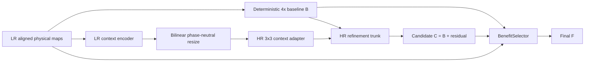

# NSAMDR production workflow

## Goal

**NSAMDR** means **Neural Structure-Aware Material Detail Reconstruction**.

The project goal is to reconstruct authored EVE ship material textures at **4x** from the
available lower-resolution authored maps while preserving the original art direction and
physical-map alignment.

The intended result is not a generic sharpen filter. NSAMDR should:

- remove interpolation blur and pixel stair-stepping;
- recover crisp manufactured seams, panel boundaries and contours;
- restore evidence-supported high-frequency hull detail;
- reconstruct aligned albedo, normal, material, emissive and roughness behaviour;
- preserve regions already reconstructed correctly by the deterministic baseline;
- avoid inventing unsupported texture content;
- fail closed to the deterministic result when the learned reconstruction is not better.

[](./EXAMPLE.png)

`EXAMPLE.png` remains the visual target: the final texture should look like a credible
higher-resolution version of the authored EVE asset, not like a sharpened low-resolution
image and not like newly invented artwork.

---

## Quick start

From the Trinity repository root:

```bat
scripts\build\nsamdr.bat gui
```

The current production-development path is **V14.1 phase-neutral HR-first SR**.

---

## 1. A / B / C / F contract

All learned reconstruction is judged relative to a deterministic 4x baseline made from
the same LR evidence.

- **A — authored target**: genuine authored high-resolution EVE pixels. Available only
  during training and qualification.
- **B — deterministic baseline**: bicubic albedo, normalized bilinear normal XY and
  nearest-neighbour material channels.
- **C — SR candidate**: learned 4x residual reconstruction over B.
- **F — final output**: local BenefitSelector result between B and C.

The production relationship is:

```text
C = B + learned HR residual
F = B + selector * (C - B)
```

A candidate is useful only when it moves B materially toward A. A selector is not allowed
to hide a fundamentally bad C and call the experiment successful.

For regions where B is already correct, final protected preservation remains:

```text
protectedPreservationRate >= 0.990
```

---

## 2. V14.1 production architecture

V13 showed that an LR-grid-led residual path could be locally capable yet fail
representative Raven reconstruction. V14 replaced the old geometry/SDF/seam stack with a
clean HR-first residual model. The first V14 capacity run improved B but still showed
excess 4x lattice structure because its LR context encoder used a learned 16-phase
PixelShuffle path.

V14.1 removes that remaining phase shortcut. LR features remain ordinary LR context,
are resized phase-neutrally, then adapted by a normal HR convolution before the residual
trunk sees them.



The critical invariant is:

> **LR evidence may condition reconstruction, but it must not own fixed 4x output phases.**

The actual residual-generating trunk reasons in output-resolution coordinates around B.
There is no PixelShuffle or learned sub-pixel phase tensor in the candidate path.

The BenefitSelector sees aligned albedo, normal and material baseline/candidate maps,
their residual magnitude and LR-visible evidence. One shared gate therefore protects the
aligned physical output rather than judging albedo in isolation.

V14.1 contains no production GeometryNet, spline/SDF renderer, boundary renderer, profile
specialist or seam-restoration stage.

---

## 3. Clean model ownership

The canonical production implementation lives under:

```text
tools/nsamdr/neural/v14/
```

The package directly owns baseline construction, model, dataset loading, losses,
qualification, checkpoint handling, tiled inference, training and diagnostics. It does
not install historical monkey-patch contracts.

The V14.1 checkpoint schema is:

```text
NSAMDR_HR_FIRST_MULTI_MAP_SR_4X_V14_1
```

V14.0 and older checkpoints are intentionally incompatible because the candidate topology
changed.

---

## 4. Native authored resolution

Training truth must always come from the **highest genuine native authored semantic map
available**. A lower-resolution texture must never be enlarged first and then treated as
new high-resolution truth.

Examples:

```text
native 4096 asset -> supervise 1024 -> 4096
native 2048 asset -> supervise  512 -> 2048
native 1024 asset -> supervise  256 -> 1024
```

The current Raven Navy Issue SOF semantic material set used by the development workflow
is native **1024x1024**, so Raven can provide genuine `256 -> 1024` supervision but not a
genuine authored `1024 -> 4096` target.

Production still applies the learned 4x model to native Raven input:

```text
native EVE 1024 -> NSAMDR 4096
```

That final 4096 result is learned reconstruction, not supervised 4096 ground truth for
this specific Raven asset.

---

## 5. Training geometry and curriculum

V14.1 Quick uses materially larger spatial context than the old `32 -> 128` regime:

```text
training crop      : 128 LR -> 512 HR
held-out crop      : 128 LR -> 512 HR
native Raven check : 256 LR -> 1024 HR when native 1K maps are available
production         : 1024 LR -> 4096 HR via tiled inference
```

The SR curriculum is split by task:

1. **clean SR** — mathematically defined area reduction teaches the 4x inverse problem;
2. **robust SR** — only after clean reconstruction, mild EVE-like degradation is added;
3. **BenefitSelector** — trained only after C passes candidate qualification.

This separation prevents a failed reconstruction architecture from being hidden by an
aggressive degradation curriculum.

---

## 6. Candidate objective

Candidate C is trained to reconstruct authored truth directly with a small set of
non-overlapping objectives:

- direct albedo reconstruction;
- gradient and Laplacian/high-frequency reconstruction;
- multiscale reconstruction;
- direct residual supervision against `A - B`;
- aligned normal reconstruction;
- aligned material reconstruction.

There is no stacked candidate-preservation penalty whose easiest solution is `C ~= B`.
Already-correct regions naturally have `A - B ~= 0`; direct residual supervision teaches
zero correction there. Hard final safety remains the BenefitSelector's responsibility.

---

## 7. Pixelation / LR-lattice rejection

Blockiness is a qualification failure, not a tuning weight.

NSAMDR compares how strongly `C - B` is explained by a cell-constant 4x projection against
the same measurement for the true residual `A - B`. The measurement checks every possible
4x phase. A candidate that is materially more LR-cell-like than the authored correction
is rejected even if average reconstruction error improves.

The current maximum is:

```text
max excess LR-lattice cell projection <= 15%
```

V14.1 also removes the architectural shortcut that caused the first V14 capacity run to
produce excess lattice structure: there is no PixelShuffle in the candidate path.

Every production-training epoch publishes:

```text
A AUTHORED | B BASELINE | C V14.1 SR | F SELECTED
```

---

## 8. Diagnostic ladder

The GUI retains fast diagnostics because they answer different questions before an
expensive Raven Quick run. They use the **same V14.1 model**, not special diagnostic
networks, and cannot promote production checkpoints.

1. **V14.1 HR Residual Capacity**
   - one deterministic high-detail Raven region;
   - `128 -> 512`;
   - maximum 3072 steps at LR `0.001`;
   - logs recovery, residual magnitude, gradient norm and lattice excess;
   - stops as soon as the real candidate gates pass.

2. **V14.1 Multi-Region SR Mini**
   - small disjoint train/held-out Raven set;
   - checks that local capacity generalises beyond one patch.

3. **V14.1 Selector Retention Mini**
   - freezes a passing candidate;
   - trains only BenefitSelector;
   - checks recovery retention and protected-B preservation.

4. **V14.1 Raven Quick**
   - first promotable experiment;
   - representative held-out qualification.

Do not proceed to Multi-Region if Capacity fails. If the phase-neutral candidate cannot
overfit one known Raven region under the stronger capacity budget, change the model class
rather than repeatedly adjusting loss constants.

---

## 9. Qualification

Candidate qualification is baseline-relative. Only fixed disjoint held-out crop records
count toward pass/fail, and at least **4 independent held-out samples** are required.
Full-native Raven `256 -> 1024` checks are separate scale telemetry and cannot manufacture
a held-out pass.

| Requirement | Threshold |
| --- | ---: |
| Independent held-out samples | >= 4 |
| Median candidate edge recovery | >= 60% |
| Median candidate global recovery | >= 45% |
| Median candidate gradient recovery | >= 35% |
| Positive-edge patch fraction | >= 75% |
| Positive-global patch fraction | >= 75% |
| Median normal recovery | >= 0% |
| Median material recovery | >= 0% |
| Worst candidate recovery | >= -10% |
| Max excess LR-lattice cell projection | <= 15% |

Only after C passes does the selector train.

Final qualification additionally requires:

| Requirement | Threshold |
| --- | ---: |
| Selector edge retention | >= 90% |
| Selector global retention | >= 90% |
| Median final normal recovery | >= 0% |
| Median final material recovery | >= 0% |
| Protected-B preservation | >= 99% |
| Worst final recovery | >= -10% |
| Max excess LR-lattice cell projection | <= 15% |

A catastrophic patch can reject an otherwise good median result.

---

## 10. Quick and Full invariant

Raven Quick and Full Training must use the same:

- V14.1 production model;
- module graph;
- deterministic 4x baseline;
- candidate objective;
- selector behaviour;
- tiled inference implementation;
- checkpoint schema;
- qualification/provenance contract.

They may differ only in work budget and dataset scale.

Full Training remains disabled until Raven V14.1 candidate qualification passes. Once the
architecture is proven, Full should preferentially use the highest-native-resolution EVE
semantic families available, especially genuine 4K families that directly supervise the
production `1024 -> 4096` task.

---

## 11. Checkpoint and provenance

A qualified experiment promotes exactly one checkpoint to:

```text
checkpoints/final/nsamdr_v14.pt
```

The final manifest records its SHA-256 and schema. The checkpoint must strict-load into a
fresh V14.1 model before preview/baking.

No post-model repair, hidden sharpening or candidate cleanup is permitted.

---

## 12. Production inference

Production 4K output uses tiled inference so the HR-first trunk does not require one full
4096 feature tensor in memory at once.

For Raven:

```text
1024 native LR physical maps
        -> overlapping 128 LR tiles
        -> V14.1 512 HR tile reconstruction
        -> overlap blend
        -> 4096 final physical maps
```

The same model call and weights are used in diagnostics, Quick, qualification and
production inference.

---

## 13. Commands

```bat
scripts\build\nsamdr.bat gui
scripts\build\nsamdr.bat raven-quick
scripts\build\nsamdr.bat preview EXP_####
scripts\build\nsamdr.bat validate
```

---

## 14. Completion condition

The project is not complete because a metric is green or because a selector can hide a
bad candidate.

> **Given representative held-out EVE authored textures, NSAMDR FINAL must look
> materially closer to the authored high-resolution target than deterministic 4x B,
> while preserving already-correct regions and aligned physical-map behaviour.**

The immediate V14.1 milestone is deliberately narrow and falsifiable:

```text
prove that phase-neutral HR-first candidate C materially beats B on one Raven capacity
region without LR-grid imprint, then prove that gain survives held-out Raven regions
```

If it cannot, reassess the SR model rather than repeatedly adjusting constants.
