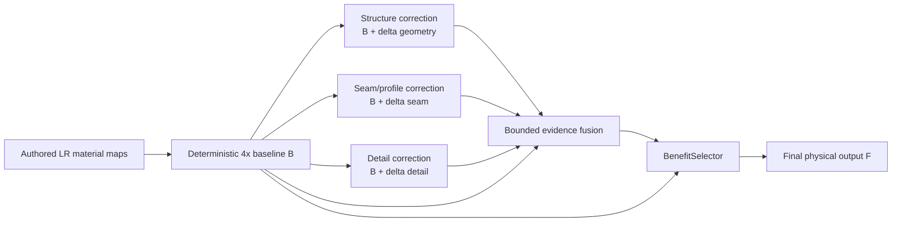

# NSAMDR production workflow

## Quick start

From the Trinity repository root:

```bat
scripts\build\nsamdr.bat gui
```

**NSAMDR** means **Neural Structure-Aware Material Detail Reconstruction**. It is a
learned 4x reconstruction system for authored EVE ship material textures. It is not a
generic image sharpener: deterministic reconstruction remains the anchor and learned
components are allowed to correct only evidence-supported defects.

[](./EXAMPLE.png)

`EXAMPLE.png` is the intended visual direction: remove interpolation fuzz and pixel
stair-stepping, recover continuous manufactured seams and contours, preserve aligned
normal/material behaviour, and restore evidence-supported authored microdetail. It is
not permission to invent missing pixels. A learned result must beat the deterministic
baseline on held-out authored evidence or fail closed.

## 1. A / B / C contract

Every learned stage is judged against the deterministic 4x reconstruction available
from the same degraded LR input.

- **A — authored target:** held-out high-resolution EVE texture used for training or
  qualification only.
- **B — deterministic baseline:** bicubic albedo, normalized bilinear normal XY and
  nearest-neighbour physical material channels.
- **C — learned candidate:** the exact candidate produced by the production path being
  trained or qualified.

A useful specialist moves C from B toward A. Equality is the safe identity state; a
worse C is a failure, not something a later selector is allowed to hide.

For regions where B is already correct, the V12.4 protected-preservation contract is:

```text
protectedPreservationRate >= 0.990
```

A protected training/qualification pixel is one whose B value is already within
`2/255` of A in every albedo channel. At least 99% of those pixels must remain within
`1/255` of B. This target-derived label exists only while training or qualifying.
Production inference never receives authored HR.

## 2. Baseline-centred specialist architecture

The production model is evolving from a fragile serial reconstruction chain into
independently useful corrections around B:



Responsibilities are deliberately narrow:

| Specialist | Responsibility | Must not do |
| --- | --- | --- |
| Structure / geometry | Correct contour position, connectivity and raster stair-stepping. | Repaint texture detail or invent unsupported topology. |
| Boundary / seam profile | Correct fuzzy, over-wide, ringing or phase-damaged physical transitions. | Depend on a bad learned geometry result merely to be useful. |
| Detail | Restore non-parametric high-frequency appearance and physical-map detail lost by deterministic interpolation. | Move accepted structure or use upstream failure as its base. |
| BenefitSelector | Apply the final local safety decision between B and the complete useful candidate. | Turn an intrinsically bad candidate into a qualification pass. |

V12.3 already establishes the independent detail path: `GeometryConditionedDetailNet`
keeps its existing checkpoint topology but its production candidate is a bounded direct
residual over B. Learned geometry/seam state cannot poison that candidate. V12.4 adds
shared protected-region supervision so both detail training and final selector training
pay an explicit cost for modifying pixels B already reconstructs correctly.

Structure and seam remain independently auditable while their own baseline-relative
qualification is completed. They must earn authority separately before broader fusion
is allowed to depend on them.

## 3. Production invariants

`FidelityResidualNetV9` remains the canonical production model. Existing state-dict
keys and checkpoint compatibility are preserved by the V12.x contracts; the work here
does not introduce a Raven-only production network.

The only deployable model call is:

```python
outputs = model(inputs)
```

Production inference consumes LR authored evidence only. Training-only targets,
teachers, forced authorities and oracle geometry are not public inference arguments.
The failure identity remains B: unsupported, zero-authority or unqualified behaviour
must reduce to deterministic reconstruction rather than damage the source.

One model reconstructs aligned albedo, normal, material, emissive and roughness maps.
The final checkpoint must strict-load into that same model and pass a fresh direct
`model(input)` qualification with no cached or test-only override.

## 4. Structural path

The current structural implementation separates estimation from geometric refinement.
The neural branch proposes fixed connected topology and continuous crossing/tangent
parameters. A parameter-free explicit refiner may optimize those continuous values
against LR structural evidence while topology remains fixed. Authored HR is never a
production-refiner input.

B1b image-space supervision is applied to the exact rendered production structural
candidate. Historical point/tangent proxy objectives are telemetry rather than SGD
authority when they conflict with the actual rendered result. A structural candidate
must beat B itself; downstream stages cannot conceal a failed B1 candidate.

## 5. Detail path

The V12.3 detail specialist is deliberately parallel to structure/seam. Its candidate
is:

```text
D = B + bounded detail residual
```

The decoder still consumes the full native LR evidence and retains its existing
physical heads. The candidate base, however, is deterministic B rather than a serial
boundary/seam image. This preserves the capacity demonstrated by Direct Residual even
when another specialist is weak.

Detail optimisation uses baseline-relative global reconstruction, edge reconstruction,
gradient recovery, regret and direct residual supervision. V12.4 additionally protects
already-correct B pixels. The final selector receives B, the independent detail
candidate and LR-observable evidence rather than requiring learned geometry/seam state.

## 6. Training and qualification order

Use the shortest proof that answers the current question. Do not spend a Full run to
rediscover a local capacity failure.

1. **Identity / preservation:** prove the candidate fails closed and preserves at least
   99% of already-correct protected pixels.
2. **Detail capacity:** prove the independent B-relative detail candidate can beat B on
   a fixed hard Raven patch.
3. **Structure capacity:** require the exact rendered structural candidate itself to
   beat B on held-out Raven evidence.
4. **Seam/profile capacity:** require useful seam/profile recovery independent of an
   unqualified structural candidate.
5. **Fusion:** combine only specialists that independently improve B and verify that
   composition preserves their gains.
6. **Raven Quick:** run the complete production model with reduced work budget.
7. **Full Training:** only after the earlier gates are stable.

Teacher/oracle runs remain useful for proving representation capacity, but they are not
production qualification.

## 7. Raven Quick versus Full Training

`Raven Quick` and `Full Training` instantiate the same production model, schema, module
graph, loss definitions, inference mode and final qualification. Quick may reduce only
work-budget inputs such as crop count, epochs/steps, validation frequency and caches for
frozen production outputs.

There is no Raven-only final network, candidate generator or checkpoint schema.

## 8. Checkpoint and provenance

The canonical final checkpoint for an experiment is:

```text
checkpoints/final/nsamdr_v9_fidelity.pt
```

The experiment workflow records the complete production state, copies it to the final
path, calculates a full SHA-256, marks the copy immutable/read-only, records provenance
in `final_manifest.json`, bakes candidate physical maps from that exact checkpoint and
re-verifies source/candidate/checkpoint provenance before preview.

Missing, stale, intermediate, mutated or unqualified artifacts fail closed. Prefix
hashes, visual similarity and labels such as `best` are not provenance.

## 9. Diagnostics layout

Non-promotable diagnostic evidence now has one root:

```text
artifacts/nsamdr/diagnostics/
├── micro/
│   ├── MICRO_<timestamp>/
│   └── MICRO_<timestamp>_DIAGNOSTICS.zip
├── direct_residual/
│   └── DIRECT_<timestamp>/
└── parallel_detail/
    └── PARALLEL_<timestamp>/
```

The compatibility launchers migrate existing contents from the historical sibling
folders (`micro_diagnostics`, `direct_residual_diagnostics` and
`parallel_detail_diagnostics`) before/after a diagnostic run. Partial evidence is also
moved when a diagnostic raises.

`artifacts/nsamdr/experiments/EXP_####_DIAGNOSTICS.zip` remains beside its production
experiment because it is immutable experiment provenance, not one of the ad-hoc
capacity/authority diagnostic roots.

## 10. Production experiment layout

Each experiment under `artifacts/nsamdr/experiments/EXP_####/` contains the resolved
configuration, training log, architecture participation, metrics/evidence, immutable
final checkpoint metadata and previews. A failed experiment stays diagnostic-only and
cannot produce a qualified `B NSAMDR FINAL` preview.

## 11. Renderer behaviour

The native preview contains exactly two comparable panes:

- **A RAW SOURCE**
- **B NSAMDR FINAL**

Both use the same mesh, camera, shader path, sampler, LOD and render settings. The final
pane samples physical maps baked from the immutable production checkpoint. There is no
candidate-only renderer cleanup or post-model repair.

## 12. Commands

Run from the repository root.

```bat
scripts\build\nsamdr.bat gui
scripts\build\nsamdr.bat raven-quick
scripts\build\nsamdr.bat full-train
scripts\build\nsamdr.bat preview EXP_####
scripts\build\nsamdr.bat validate
```

The native OBJ launcher is an internal preview bridge, not a second checkpoint or
training surface.

## 13. OOP / source ownership

Application and training orchestration use composition over inheritance. Implementation
methods document `Purpose`, `Called by` and `Calls`; local callees are declared above
their callers. Compatibility entry points remain thin. The larger Stage-3 decomposition
of `v9/training.py` is intentionally separate from reconstruction behaviour changes.
See `OOP_ARCHITECTURE.md` and `NSAMDR_OOP_CLASS_HIERARCHY.mmd`.

## 14. Research references

NSAMDR is an engineering system rather than a direct implementation of one paper. Key
influences remain:

- VDSR, LapSRN and SwinIR: preserve a known reconstruction path and learn the missing
  residual rather than repainting everything.
- Deep Vectorization of Technical Drawings: neural estimation can initialize an
  explicit geometric optimization stage.
- End-to-End Line Drawing Vectorization: connectivity should be represented explicitly.
- DiffVG and LIVE: image-space objectives can optimize continuous vector geometry, but
  raster loss alone does not solve discrete topology.
- Long smoothing B-splines: useful smooth-curve priors must preserve intentional
  corners, junctions and manufactured discontinuities.

See `NSAMDR_BASELINE_RELATIVE_DESIGN.md` for the acceptance contract carried into the
current V12.x architecture.

## Non-negotiable invariant

> Raven Quick, Full Training, Preview and production inference converge on the same
> production model and immutable checkpoint contract. Work budget may change; the
> deployable architecture may not.
