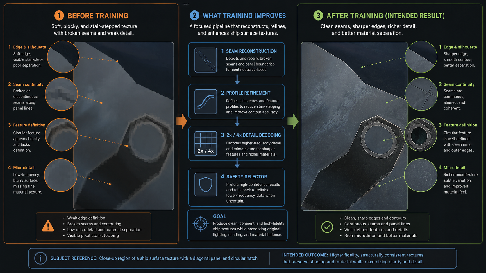
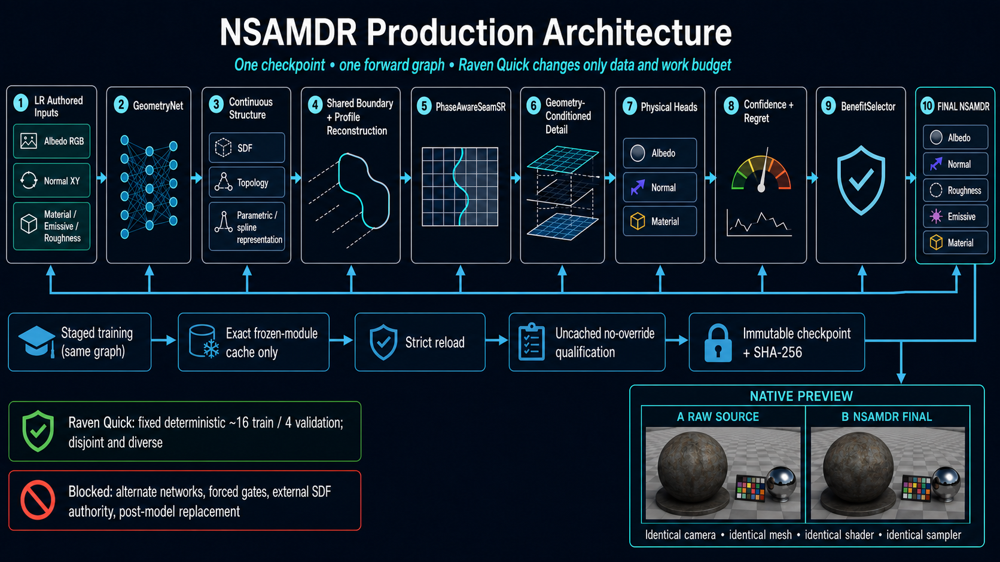

# NSAMDR production workflow

## Quick start

From the Trinity repository root, launch the workflow GUI with the canonical NSAMDR script:

```bat
scripts\build\nsamdr.bat gui
```

**NSAMDR** stands for **Neural Structure-Aware Material Detail Reconstruction**.
It is a learned 4x reconstruction system for authored EVE ship textures. The
project is not intended to be a generic image upscaler: it reconstructs physical
texture maps while explicitly modelling the manufactured structure that created
them.

This document describes the cleaned production contract. Historical capability
probes, generalisation experiments, patch-specific launchers, and obsolete
renderer modes belong in Git history, not in the runtime workflow.

[](./EXAMPLE.png)

> **Illustrative target outcome:** `EXAMPLE.png` defines the intended visible
> behaviour of NSAMDR: cleaner supported contours, continuous seams,
> well-defined manufactured features, and richer evidence-supported
> microdetail. It is not a claim that every crop can recover the exact lost
> authored pixels. A learned candidate must still beat the deterministic
> baseline on held-out evidence; otherwise the workflow fails closed.

## 1. Why NSAMDR exists

A conventional super-resolution network sees a low-resolution image and tries
to predict a sharper image. That is not sufficient for EVE material assets.
One ship material can contain several aligned authored signals with different
physical meanings:

- albedo colour and paint detail;
- tangent-space normal relief;
- material identity and transitions;
- emissive information;
- roughness information;
- thin panel seams, circles, hatches, rings, corners, junctions, scratches, and
  small manufactured fittings.

Those features are correlated. A panel boundary that is reconstructed in
albedo but not in the normal or material map is physically inconsistent. A
sharpening filter can also make a blurred seam look stronger without recovering
its true subpixel position, width, continuity, or material transition.

NSAMDR therefore treats 4x reconstruction as three linked problems:

1. **recover structure** - infer the continuous manufactured geometry that was
   damaged by downsampling;
2. **recover boundary and seam profiles** - reconstruct the physical transition
   across that geometry with one shared spatial authority;
3. **recover authored appearance detail** - restore high-frequency texture and
   relief that cannot be represented by analytic geometry alone.

The final candidate is then passed through learned confidence, regret, and
benefit selection so the production model can retain the authored baseline
where reconstruction is not supported.

The intended visible result is not merely a sharper bicubic texture. The target
is continuous seams, cleaner subpixel contours, reconstructed manufactured
features, coherent fine normal relief, material-detail recovery, and genuine
2x/4x microdetail while keeping all physical maps aligned.

## 2. Production data flow

NSAMDR consumes low-resolution authored material inputs:

- albedo RGB;
- tangent-space normal XY;
- material, emissive, and roughness semantics;
- deterministic degradation and geometry-guidance channels assembled by the
  production input builder.

The production path runs those inputs through `GeometryNet`, the continuous
structural/SDF representation, deterministic boundary redraw,
`BoundaryProfileSpecialist`, `PhaseAwareSeamSR`, geometry-conditioned
`DetailNet`, the explicit 2x-to-4x decoder, the aligned physical-map heads,
confidence/regret estimation, and finally `BenefitSelector`.

The structural path and appearance path deliberately have different jobs.
Geometry owns contour placement. The deterministic boundary renderer converts
that geometry into a physical transition. The profile and seam specialists
refine shared boundary/seam behaviour. `DetailNet` then restores non-parametric
high-frequency appearance without being allowed to move the accepted contour.

The current production structural implementation uses a learned bounded 2x
topology field to form a hard-connected marching-squares graph. Shared
edge-crossing nodes and tangents are rendered as connected cubic-Hermite
spans and queried as a metric SDF. V11.6 constrains each learned crossing to
its owning control edge, while V11.7 gives baseline-relative regret losses
direct optimisation authority during structural training. The retired
whole-tile primitive classifier/regressor remains compatibility telemetry
only and has no production structural authority.

One production model reconstructs aligned high-resolution albedo, normal,
material, emissive, and roughness maps. Geometry, boundary profiles, seam
reconstruction, appearance detail, physical heads, confidence/regret, and the
benefit selector execute inside that model's production forward graph. The
renderer never substitutes a second network or repairs the candidate after the
checkpoint output is baked.

The canonical model class is `FidelityResidualNetV9`. Its schema is the
`MODEL_SCHEMA` exported by `tools/nsamdr/neural/v9/model.py`; checkpoints with
any other schema are rejected.

The only deployable model call is:

```python
outputs = model(inputs)
```

Training-only teacher signals are isolated behind the private training entry
point. Production callers cannot replace SDF geometry, gates, hardness, seam
authority, cached intermediate state, or any other model authority.

## 3. Architecture diagram

[](./NSAMDR_FULL_SYSTEM_ARCHITECTURE.png)

The diagram is a compact view of the executable contract. The authoritative
machine-readable evidence for an experiment is
`architecture_participation.json`, produced by instrumenting the real forward
graph before and after training.

### Genetic / evolutionary recovery

V11.4 adds a **training-only bounded evolutionary recovery controller** around
the production structural representation. It does not create a second Raven
network, substitute a different inference path, weaken a qualification gate, or
change the final output contract. Evolution searches only a small bounded genome
of authorities already present inside the production model.

The controller first classifies the reason a structural attempt failed:

| Failure class | Typical examples | Response |
| --- | --- | --- |
| **Software / contract** | missing attribute, invalid tensor shape, import/interface failure | Stop and preserve the error. No evolution. |
| **Numerical** | NaN, non-finite loss, CUDA OOM | Stop or use the normal runtime recovery path. Architecture evolution is not used to hide the error. |
| **Learning** | finite, structurally valid model with weak optimisation/generalisation | Normal bounded training failure; no architecture mutation by default. |
| **Representation** | topology regression, missing contours, negative structural gain, catastrophic structural mismatch | Bounded evolutionary recovery is allowed. |

The bounded production genome controls existing structural authorities such as
`feature_gain`, `physical-evidence_gain`, `distance_scale`, `curvature_scale`,
`ribbon_scale`, `extra_branch_gain`, `csg_logit_scale`, and
`correction_scale`. Each field has a hard numeric range; mutation cannot add or
remove networks or change output semantics.

Before expensive training, a small **real Raven capacity microproof** evaluates
a small candidate population with only a few optimisation steps. It scores
structural improvement, topology/sign regression, local SDF gradient error,
correction magnitude, finite behaviour, and whether the production structural
module actually learns. Synthetic line/circle/ring proofs remain structural
sanity checks, but they do not replace the real-Raven evidence.

A structurally qualified winning genome is stored in the production state
dictionary as `geometry_net.production_structure.evolution_genome`, with the
last qualified repository-level seed recorded at
`artifacts/nsamdr/evolution/locked_local_boundary_genome.json`.

If B1/B2 later fails specifically as a representation failure, bounded recovery
may retry the structural stage. The failed structural state is retained as
evidence, only the bounded genome is changed, and downstream seam/detail/selector
stages remain blocked until the unchanged production structural gate passes.

Production inference remains the same direct model call shown above. The
evolutionary controller is training orchestration only and is not present in
production inference.

## 4. Major modules

| Component | Production responsibility | Evidence required |
| --- | --- | --- |
| `GeometryNet` | Encodes the complete LR input and produces the geometry features used by reconstruction. | Forward call, parameter count, training state, gradient/update evidence. |
| Continuous structure | Produces the topology and connected-spline metric SDF. Its output is owned by the model, not an external fitter. | Forward reachability, structural losses, final-forward output. |
| Boundary renderer/profile | Reconstructs two physical sides of a boundary and refines their shared coverage profile. The renderer is deterministic; the profile specialist is learned. | Shared use by albedo, normal, and material plus profile loss/update evidence. |
| `PhaseAwareSeamSR` | Reconstructs phase-sensitive 2x/4x seam information from authored LR maps. | Forward call and seam-stage gradient/update evidence. |
| Seam authority | Limits seam reconstruction to supported locations and controls how the phase proposal enters the physical candidate. | Forward call, authority loss/metric, non-bypassed final output. |
| `DetailNet` | Restores missing high-frequency appearance using geometry-conditioned features without restricting all texture detail to a boundary band. | Explicit residual, gradient/high-frequency losses, forward and update evidence. |
| Albedo/normal/material heads | Produce bounded physical-map residuals from the shared detail features. Emissive and roughness are derived from the material output. | Per-head forward calls, gradients, updates, and final output keys. |
| Confidence/regret heads | Estimate local reconstruction support and expected harm. | Forward calls, supervised loss contribution, serialized state. |
| `BenefitSelector` | Applies the learned safety decision that chooses between the authored baseline and the complete reconstructed candidate. | Forward call, selector loss/update, and authority in final inference. |

Class names alone do not prove participation. The architecture contract installs
forward hooks on these production modules, consumes the trainer's per-stage
gradient/update evidence, strict-loads the immutable checkpoint, and performs a
fresh direct `model(input)` qualification.

## 5. Raven Quick versus Full Training

`Raven Quick` and `Full Training` instantiate the same model class, schema,
module graph, loss definitions, inference mode, and final qualification.

Only work-budget inputs may differ:

- dataset and deterministic train/validation crop IDs;
- crop count and batch/step/epoch budget;
- validation frequency and audit sample count;
- caching of exact outputs from production modules that are frozen for the
  current stage;
- other runtime settings that cannot change model semantics.

The fixed Raven development split is approximately 16 training crops and four
spatially disjoint validation crops. Selection is deterministic and
feature-stratified across diagonal edges, long seams, circles/rings, thin lines,
small fittings, scratches, flat microtexture, normal relief, and material
transitions. It is not a top-detail or easiest-crop ranking.

There is no Raven-only network, head, candidate generator, checkpoint schema, or
inference branch.

## 6. Training stages

Training may freeze qualified modules, but every stage operates on the same
complete checkpoint topology:

1. geometry and continuous structural representation;
2. shared boundary and coverage-profile reconstruction;
3. phase-aware seam reconstruction;
4. geometry-conditioned appearance/detail residuals;
5. albedo, normal, and material physical heads;
6. seam authority;
7. confidence, regret, and `BenefitSelector`;
8. joint physical fine-tuning and final model selection.

Teacher signals are training-only supervision. They may not become public
inference arguments or renderer-time overrides.

A frozen-module cache is valid only when its tensor is the exact detached output
of that frozen production module. The cache contract records a numerical
cached-versus-uncached comparison. Qualification always clears the cache and
runs the full graph.

## 7. Qualification gates

An experiment is not previewable until all applicable gates pass:

- architecture preflight finds every required production component and observes
  it in a direct forward call;
- intended trainable components record finite, non-zero gradients and a
  parameter delta from their stage start;
- frozen components remain unchanged in stages where they are declared frozen;
- required loss contributions and validation metrics are present and finite;
- cached and uncached frozen-module outputs agree within the configured numeric
  tolerance;
- the selected state dictionary strict-loads into the production model;
- checkpoint schema equals the production `MODEL_SCHEMA`;
- a fresh `model.eval(); model(input)` call completes with no overrides,
  cached intermediates, forced gates, or test-only branch;
- all required output maps are finite and have the expected 4x dimensions.

Failure leaves the experiment diagnostic-only. It cannot generate or launch a
`B NSAMDR FINAL` preview.

## 8. Checkpoint and provenance contract

There is one final checkpoint for an experiment:

`checkpoints/final/nsamdr_v9_fidelity.pt`

The workflow:

1. writes the selected complete production state;
2. copies it to the canonical final path;
3. calculates SHA-256 over the copied bytes;
4. marks the copy read-only and hashes it again;
5. records the exact path, schema, qualification result, and SHA-256 in
   `final_manifest.json`;
6. generates physical candidate maps from that exact checkpoint;
7. records the identical full SHA-256 in candidate and preview metadata;
8. re-hashes checkpoint, source, and candidate files before native launch.

Any missing, stale, intermediate, unqualified, mutated, or mismatched artifact
fails closed before the renderer process starts. Prefix hashes and labels such
as "best", "representative", or "looks final" are not provenance.

## 9. Renderer behavior

The native preview contains exactly two panes:

- **A RAW SOURCE**
- **B NSAMDR FINAL**

Both panes use the same mesh, camera, shader path, 16x anisotropic sampler, LOD
bias, and render settings. B samples the physical maps baked directly from the
immutable production checkpoint. There is no candidate-only cleanup,
roughness compensation, fake legacy emulation, UV comparison pane, or
post-model safety replacement.

Real EVE material compatibility remains deliberate. In particular,
`ShaderFamily::LegacyPgs` parsing and its authored channel/roughness semantics
are source-format compatibility, not an obsolete NSAMDR baseline mode.

## 10. Exact commands

Run commands from the repository root.

Open the workflow GUI:

```bat
scripts\build\nsamdr.bat gui
```

Train and qualify the fixed Raven development set, then preview it:

```bat
scripts\build\nsamdr.bat raven-quick
```

Train and qualify the full production dataset:

```bat
scripts\build\nsamdr.bat full-train
```

Preview a completed qualified experiment:

```bat
scripts\build\nsamdr.bat preview EXP_####
```

Validate the canonical layout and contract before starting a new test cycle:

```bat
scripts\build\nsamdr.bat validate
```

The native OBJ launcher is an internal bridge used by the preview command; it is
not a separate training or checkpoint-selection surface.

## 11. Output directory layout

Each experiment under `artifacts/nsamdr/experiments/EXP_####/` contains:

- `resolved_config.json`;
- `training_log.csv`;
- `architecture_participation.json`;
- `final_manifest.json`;
- `metrics/`;
- `checkpoints/final/nsamdr_v9_fidelity.pt`;
- `checkpoints/final/nsamdr_v9_fidelity.json`;
- `evidence/`;
- `previews/`.

The workflow also writes:

`artifacts/nsamdr/experiments/EXP_####_DIAGNOSTICS.zip`

The diagnostics archive contains the resolved configuration, logs and metrics,
architecture participation, qualification evidence, immutable checkpoint
checksum metadata, source/candidate provenance, and renderer launch record.
Capability-first, generalization, recovery, and temporary experiment trees are
not production outputs.

## 12. Troubleshooting

**Architecture preflight fails**

Read `architecture_participation.json`. A missing hook or production output is
a real contract failure; do not bypass it with a Raven-specific implementation.

**A component is active but not trained**

Inspect the stage row for gradient norm, loss contribution, and parameter
delta. Check phase freezing and loss wiring. Do not force a gate during final
qualification to make the component appear effective.

**Cache equivalence fails**

Discard the cache and compare the frozen module's exact output, dtype, shape,
device transfer, and evaluation state. Final qualification remains uncached.

**Strict checkpoint load or SHA verification fails**

Do not preview. Confirm the checkpoint schema, exact canonical path, full
64-character SHA-256, read-only copy, and `final_manifest.json`. Never fall
back to a stage checkpoint.

**Candidate or source provenance fails**

Delete only the experiment's generated `previews/` outputs and regenerate them
from the immutable final checkpoint. Authored source textures must remain
unchanged.

**Native preview does not build**

Use the canonical preview command so it configures the isolated
`NSAMDRPreview_dx11` target. The repository currently targets Python 3.10 and
uses the CMake preset/toolchain declared by the repository; do not create a
second viewer project.

**Legacy EVE material looks wrong**

Verify shader-family parsing and authored semantic channels before changing
NSAMDR. `LegacyPgs` is intentionally retained for real source compatibility.

## 13. Research inspirations and references

NSAMDR is an engineering system rather than a direct implementation of any one
paper. The following works have materially influenced its reconstruction,
vectorisation, residual-learning, and geometry-design choices. They are retained
here so future architecture changes can be checked against the original ideas
rather than against accumulated implementation assumptions.

| Work | NSAMDR design lesson / influence |
| --- | --- |
| J. Kim, J. K. Lee, K. M. Lee, **[Accurate Image Super-Resolution Using Very Deep Convolutional Networks (VDSR)](https://openaccess.thecvf.com/content_cvpr_2016/html/Kim_Accurate_Image_Super-Resolution_CVPR_2016_paper.html)**, CVPR 2016. | Residual learning: preserve a known reconstruction path and learn the missing correction rather than repainting the complete output. |
| W.-S. Lai, J.-B. Huang, N. Ahuja, M.-H. Yang, **[Deep Laplacian Pyramid Networks for Fast and Accurate Super-Resolution (LapSRN)](https://openaccess.thecvf.com/content_cvpr_2017/html/Lai_Deep_Laplacian_Pyramid_CVPR_2017_paper.html)**, CVPR 2017. | Progressive reconstruction and explicit high-frequency residual recovery across scales; relevant to the 2x-to-4x detail path. |
| J. Liang, J. Cao, G. Sun, K. Zhang, L. Van Gool, R. Timofte, **[SwinIR: Image Restoration Using Swin Transformer](https://arxiv.org/abs/2108.10257)**, 2021. | Strong image-restoration framing, residual feature paths, and larger-context reasoning for appearance/detail restoration. |
| V. Egiazarian et al., **[Deep Vectorization of Technical Drawings](https://www.ecva.net/papers/eccv_2020/papers_ECCV/html/1978_ECCV_2020_paper.php)**, ECCV 2020. | Particularly important structural precedent: neural cleaning/primitive estimation is followed by an explicit optimisation procedure for the final primitive configuration. This is the reference escalation if a learned structural field cannot reliably produce final geometry by itself. |
| H. Liu, C. Li, X. Liu, T.-T. Wong, **[End-to-End Line Drawing Vectorization](https://ojs.aaai.org/index.php/AAAI/article/view/20379)**, AAAI 2022. | Connectivity and stroke structure should be represented explicitly; direct vector primitive tracing can avoid failure modes caused by raster-only segmentation followed by disconnected fitting. |
| T.-M. Li, M. Lukac, M. Gharbi, J. Ragan-Kelley, **[Differentiable Vector Graphics Rasterization for Editing and Learning (DiffVG)](https://people.csail.mit.edu/tzumao/diffvg/)**, ACM TOG / SIGGRAPH Asia 2020. | Differentiable rasterisation allows image-space objectives to optimise continuous curve parameters. It does **not** solve discrete topology changes; NSAMDR must keep topology as an explicit responsibility. |
| X. Ma et al., **[Towards Layer-Wise Image Vectorization (LIVE)](https://openaccess.thecvf.com/content/CVPR2022/html/Ma_Towards_Layer-Wise_Image_Vectorization_CVPR_2022_paper.html)**, CVPR 2022. | Progressive construction and optimisation of explicit Bezier paths while preserving topology. This reinforces separating proposal/initialisation from final geometric optimisation. |
| D. Berio, M. Stroh, S. Calinon, F. F. Leymarie, O. Deussen, A. Shamir, **[Neural Image Abstraction Using Long Smoothing B-Splines](https://arxiv.org/abs/2511.05360)**, 2025. | Long smooth parameterised curves and derivative-based regularisation. For NSAMDR this is a conditional prior only: engineered corners, junctions, bevels, seam widths, and intentional kinks must not be smoothed away. |

### Design caution carried forward

Several of the vectorisation references separate **neural estimation** from
**explicit geometric optimisation**. NSAMDR must not assume that a neural
structural field should necessarily be both the initializer and the final
geometric solver. If the connected-spline B1 path cannot reliably beat the
same-evidence deterministic baseline on real Raven data, the preferred next
architecture review is a neural-proposal + explicit-geometry-optimisation
pipeline rather than repeated relaxation of qualification gates or arbitrary
loss-weight tuning.

See also `NSAMDR_BASELINE_RELATIVE_DESIGN.md` for the current A/B/C acceptance
contract and the design consequences already carried into V11.x.

## 14. Non-negotiable invariant

> Raven Quick uses the complete production NSAMDR model.
> It changes dataset/work budget only and never substitutes an alternate
> architecture.

Raven Quick, Full Training, Preview, and production inference converge on the
same `FidelityResidualNetV9`, the same `MODEL_SCHEMA`, the same direct forward
graph, and the same immutable-checkpoint provenance contract.
