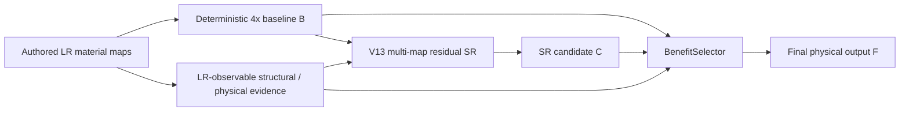

# NSAMDR production workflow

## Goal

**NSAMDR** means **Neural Structure-Aware Material Detail Reconstruction**.

The project goal is to reconstruct authored EVE ship material textures at **4x** from the
available lower-resolution authored maps while preserving the original art direction and
physical-map alignment.

The intended result is not a generic sharpen filter. NSAMDR should:

- remove interpolation blur and pixel stair-stepping;
- recover crisp manufactured seams, panel boundaries and contours;
- restore evidence-supported high-frequency hull detail;
- reconstruct aligned albedo, normal, material, emissive and roughness behaviour;
- preserve regions already reconstructed correctly by the deterministic baseline;
- avoid inventing unsupported texture content;
- fail closed to the deterministic result when the learned reconstruction is not better.

[](./EXAMPLE.png)

`EXAMPLE.png` remains the visual target: the final texture should look like a credible
higher-resolution version of the authored EVE asset, not like a sharpened low-resolution
image and not like newly invented artwork.

---

## Quick start

From the Trinity repository root:

```bat
scripts\build\nsamdr.bat gui
```

The current production-development path is **V13 SR-first**.

---

## 1. A / B / C / F contract

All learned reconstruction is judged relative to a deterministic 4x baseline made from
the same degraded LR input.

- **A — authored target**: held-out high-resolution EVE texture. Available only during
  training and qualification.
- **B — deterministic baseline**: bicubic albedo, normalized bilinear normal XY and
  nearest-neighbour physical material channels.
- **C — SR candidate**: the learned 4x residual reconstruction over B.
- **F — final output**: the local safety-selected result between B and C.

The production relationship is:

```text
C = B + bounded learned residual
F = B + selector * (C - B)
```

A candidate is useful only when it moves the reconstruction from B toward A. A worse
candidate is a failure; qualification must not declare success merely because the final
selector hides a fundamentally bad C.

For regions where B is already correct, the protected-preservation requirement remains:

```text
protectedPreservationRate >= 0.990
```

A protected training/qualification pixel is one whose B value is already within `2/255`
of A in every albedo channel. At least 99% of those pixels must remain within `1/255` of
B. These target-derived labels are training/qualification information only. Production
inference never receives authored HR.

---

## 2. Current V13 production architecture

The previous geometry-first `G -> profile -> seam -> detail` reconstruction curriculum
has been retired from Quick production authority. It consumed substantial training work
without producing sufficient rendered visual improvement.

The current architecture is deliberately simpler:



Production pixel authority is therefore:

```text
LR evidence
    -> deterministic baseline B
    -> multi-map SR candidate C
    -> BenefitSelector
    -> final F
```

The SR decoder reconstructs residuals for the aligned physical maps rather than forcing
a separate vector/spline renderer to redraw the texture first.

Structural information is still useful, but as **observable conditioning and loss
supervision**, not as a mandatory upstream pixel-authority stage. LR-derived edge/SDF,
gradient, normal-edge, material-edge, orientation and curvature evidence can guide the
SR network toward continuous manufactured structure without requiring a geometric
renderer to reproduce the final texture directly.

Some historical geometry/seam modules and state-dict keys may remain in the canonical
model while checkpoint compatibility is being reduced. They are not part of the active
V13 Quick training authority.

---

## 3. Production invariants

`FidelityResidualNetV9` remains the canonical production model while the V13 transition
is completed.

The only deployable model call is:

```python
outputs = model(inputs)
```

Production inference consumes **LR-authored evidence only**. It does not receive:

- authored HR targets;
- oracle geometry;
- forced specialist authority;
- training labels;
- cached diagnostic corrections.

The failure identity remains B. Unsupported or low-confidence learned behaviour must
reduce toward the deterministic baseline rather than damage the source.

One checkpoint reconstructs the aligned physical outputs. A final checkpoint must
strict-load into the same production model and pass fresh direct `model(inputs)`
qualification without diagnostic-only overrides.

---

## 4. V13 SR candidate

The learned candidate is a bounded residual over B:

```text
C_albedo   = clamp(B_albedo   + residual_albedo)
C_normal   = normalize(B_normal + residual_normal)
C_material = clamp(B_material + residual_material)
```

The current albedo residual headroom is:

```text
max |residual_albedo| = 0.40
```

This was increased from the earlier 0.20 cap after the single-patch Raven proof showed
that the smaller bound was directly limiting reconstruction of high-contrast authored
features.

The SR objective is visual-fidelity driven. It includes baseline-relative reconstruction
terms such as:

- global reconstruction error;
- edge-weighted reconstruction error;
- gradient recovery;
- Laplacian / high-frequency recovery;
- regret relative to B;
- direct residual supervision;
- normal/material physical-map reconstruction;
- protected-B preservation.

The purpose is straightforward: reconstruct the authored HR texture as accurately as
the LR evidence permits, while strongly weighting structural edges and physically
important transitions.

---

## 5. BenefitSelector safety

The BenefitSelector decides locally how much of C should replace B:

```text
F = B + p * (C - B)
```

where `p` is learned from production-visible evidence.

The selector is not a license for C to be poor. The SR candidate must already improve
B. The selector then removes unsafe/local regressions while retaining most of the useful
candidate gain.

Selector checkpoint choice treats protected preservation as a **constraint**, not a
score to maximize indefinitely. Once the required 99% preservation is satisfied,
additional preservation should not be rewarded by unnecessarily throwing away visible
reconstruction quality.

---

## 6. Qualification

### Fixed-patch capacity proof

The V13/V13.1 Raven SR diagnostic exists to answer one narrow question quickly:

> Can the production SR path visibly reconstruct more of A than deterministic B on a
> hard authored Raven patch?

It is a capacity proof, not final production qualification.

### V13.2 representative Raven qualification

Raven Quick now trains the SR-first path across multiple Raven crops and evaluates a
held-out bank of **32 patches**.

Current qualification requirements are:

| Requirement | Threshold |
| --- | ---: |
| Median candidate edge recovery | >= 60% |
| Median candidate global recovery | >= 45% |
| Median candidate gradient recovery | >= 35% |
| Positive-edge patch fraction | >= 75% |
| Positive-global patch fraction | >= 75% |
| Median normal recovery | >= 0% |
| Median material recovery | >= 0% |
| Worst candidate/final recovery | >= -10% |
| Selector edge retention | >= 90% |
| Selector global retention | >= 90% |
| Protected-B preservation | >= 99% |

One catastrophic patch can therefore reject an otherwise good median result.

The current Quick work budget uses the proven small-patch SR regime:

```text
LR tile size       : 32x32
batch size         : 1
SR training        : 8 x 384 = 3072 updates
selector training  : 3 x 384 = 1152 updates
held-out validation: 32 patches
albedo residual cap: 0.40
```

The intention is to prove generalisation over many authored patches before spending a
large Full-training budget.

---

## 7. Raven Quick and Full Training

The non-negotiable target is that Raven Quick and Full Training differ only in **work
budget and dataset scale**.

They must converge on the same:

- production model;
- module graph;
- SR objective;
- selector behaviour;
- inference call;
- checkpoint schema;
- final qualification/provenance contract.

There is no Raven-only final network.

### Current status

**Raven Quick has been converted to the V13 SR-first authority.**

**Full Training is intentionally disabled until its old curriculum is converted to the
same V13 SR-first path.** Running the old Full curriculum would reintroduce retired
geometry/profile/seam training and violate the architecture invariant above.

The next production milestone is therefore:

```text
clean V13.2 Raven Quick pass
    -> freeze SR-first architecture
    -> convert Full Training to identical B -> C -> F authority
    -> train across the broader authored EVE dataset
    -> immutable checkpoint qualification
    -> native EVE visual validation
```

---

## 8. What remains to reach the project goal

The core reconstruction architecture is no longer the primary unknown. Remaining work
is mainly generalisation and production proof:

1. **Raven Quick generalisation** — prove the cleaned V13.2 path across the held-out
   representative Raven bank.
2. **Full conversion** — remove the remaining old Full-training curriculum and use the
   same SR-first authority as Quick.
3. **Full authored EVE training** — train across a broader set of ships, materials,
   contours, decals and physical-map combinations.
4. **Held-out EVE qualification** — verify that improvements are not Raven-specific and
   that no class of authored texture suffers material regression.
5. **Immutable final checkpoint** — strict-load the exact final state and re-run direct
   production qualification.
6. **Bake physical maps from that exact checkpoint** — no post-model repair or hidden
   candidate cleanup.
7. **Native renderer proof** — compare the original source and NSAMDR final result under
   the same mesh, shader, sampler, camera, LOD and render settings.

The project is complete only when the system produces a repeatable visual improvement
on representative held-out EVE assets, not merely when a diagnostic metric is green.

---

## 9. Checkpoint and provenance

The canonical final checkpoint for an experiment is:

```text
checkpoints/final/nsamdr_v9_fidelity.pt
```

The experiment workflow records the resolved configuration and complete production
state, copies the qualified checkpoint to the final path, calculates its full SHA-256,
marks the final copy immutable/read-only, records provenance in `final_manifest.json`,
bakes candidate physical maps from that exact checkpoint and re-verifies provenance
before preview.

Missing, stale, intermediate, mutated or unqualified artifacts fail closed. Prefix
hashes, visual similarity and filenames such as `best` are not provenance.

---

## 10. Experiment and diagnostics layout

Production experiments live under:

```text
artifacts/nsamdr/experiments/EXP_####/
```

An experiment contains the resolved configuration, training log, metrics/evidence,
checkpoint state, final provenance and previews. Failed experiments remain diagnostic
and cannot produce a qualified final preview.

Non-promotable diagnostics live under:

```text
artifacts/nsamdr/diagnostics/
```

Capacity diagnostics are evidence only. They cannot be promoted into a production final
checkpoint merely because they overfit a patch successfully.

---

## 11. Renderer behaviour

The native final preview contains two directly comparable panes:

- **A RAW SOURCE**
- **B NSAMDR FINAL**

Both must use the same mesh, camera, shader path, sampler, LOD and render settings. The
NSAMDR pane samples physical maps baked from the immutable production checkpoint.

There must be no candidate-only renderer sharpening, cleanup or post-model repair.

---

## 12. Commands

Run from the repository root.

```bat
scripts\build\nsamdr.bat gui
scripts\build\nsamdr.bat raven-quick
scripts\build\nsamdr.bat preview EXP_####
scripts\build\nsamdr.bat validate
```

`full-train` remains intentionally unavailable for production use until Full has been
converted to the same V13 SR-first architecture:

```bat
scripts\build\nsamdr.bat full-train
```

The native OBJ launcher is an internal preview bridge, not a second checkpoint or
training surface.

---

## 13. Source ownership

Application and training orchestration use composition over inheritance. Compatibility
entry points should remain thin. Dead diagnostic versions, retired Quick orchestration
and unused geometry/seam training routes should be deleted rather than left as hidden
alternate production paths.

Checkpoint/model compatibility code may remain only while the current V13 model still
requires it. Compatibility is not production authority.

See `OOP_ARCHITECTURE.md` and `NSAMDR_OOP_CLASS_HIERARCHY.mmd` for the application-layer
structure.

---

## 14. Research direction

NSAMDR is an engineering system rather than a direct implementation of one paper. The
current SR-first direction is primarily influenced by residual super-resolution methods
such as VDSR, LapSRN and SwinIR: preserve a known reconstruction path and learn the
missing information rather than repainting the entire image.

Geometry/vectorization work remains useful as evidence, regularisation and diagnostic
research, particularly for continuous contours and manufactured edges, but it is no
longer required to own production pixels before the SR network may reconstruct them.

---

## Non-negotiable invariant

> Raven Quick, Full Training, Preview and production inference must converge on the same
> production SR-first model and immutable checkpoint contract. Work budget and dataset
> scale may change; the deployable architecture may not.

And the ultimate acceptance criterion remains visual:

> **Given representative held-out EVE authored textures, NSAMDR FINAL must look
> materially closer to the authored high-resolution target than deterministic 4x B,
> while preserving already-correct regions and aligned physical-map behaviour.**
