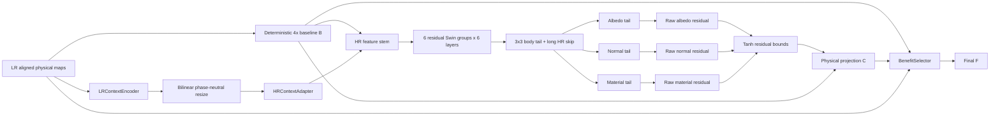

# NSAMDR production workflow

## Goal

**NSAMDR** means **Neural Structure-Aware Material Detail Reconstruction**.

The system reconstructs EVE ship material textures at **4x** from lower-resolution authored maps.
The output must preserve authored structure and physical-map alignment.

NSAMDR must:

- remove interpolation blur and pixel stair-stepping;
- recover manufactured seams, panel boundaries, contours, and supported high-frequency detail;
- reconstruct aligned albedo, normal, and material behaviour;
- preserve regions where the deterministic reconstruction is already correct;
- avoid unsupported texture invention;
- fall back to the deterministic result when the learned result is worse.

[](./EXAMPLE.png)

`EXAMPLE.png` is the visual target.

---

## Quick start

From the Trinity repository root:

```bat
scripts\build\nsamdr.bat gui
```

The active development model is **V16.0**.

---

## 1. A / B / C / F contract

All learned reconstruction is judged against a deterministic 4x baseline from the same LR evidence.

- **A — authored target**: genuine authored HR EVE pixels. A is available during training and qualification only.
- **B — deterministic baseline**: bicubic albedo, normalized bilinear normal XY, and nearest-neighbour material channels.
- **C — SR candidate**: learned physical-map residual reconstruction over B.
- **F — final output**: local BenefitSelector result between B and C.

Production relationship:

```text
C = project(B + predicted residual)
F = B + selector * (C - B)
```

C must materially improve B before the selector can train.
The selector cannot make a weak C pass qualification.

For regions where B is already correct:

```text
protectedPreservationRate >= 0.990
```

---

## 2. Evidence from V14 and V15

### V14.0

V14.0 used a learned sub-pixel path.
It produced excessive 4x LR-grid structure.

### V14.1

V14.1 removed PixelShuffle from the candidate path.
LR context moved into HR coordinates with bilinear resize and a normal HR convolution.

Capacity completed without numerical collapse:

```text
global recovery   = 53.00%   PASS
gradient recovery = 46.15%   PASS
edge recovery     = 58.02%   FAIL, required 60%
lattice excess    =  7.0%    PASS
```

This established two useful facts:

1. Phase-neutral HR reconstruction is stable.
2. A small local CNN reaches the required global and gradient recovery but remains weak on fine edge reconstruction.

### V14.2 to V14.4

These revisions introduced a custom multi-scale RCAN-style HR encoder/decoder.
They diverged during Capacity.
The failure remained after lower learning rate, group residual scaling, identity-safe initialization, and bounded residual changes.

The multi-scale custom branch is rejected.

### V15.0

V15.0 returned to one HR spatial scale and used an EDSR-style residual CNN.
It completed the full Capacity test without divergence.

Best stable result:

```text
global recovery   = 51.00%   PASS
gradient recovery = 42.70%   PASS
edge recovery     = 54.63%   FAIL, required 60%
lattice excess    =  7.07%   PASS
```

The result is a stable capacity failure.
It shows that a conventional local residual CNN remains below the required edge reconstruction level.

### V16.0 decision

V16.0 changes only the deep candidate feature extractor.
It replaces the V15 EDSR body with a **SwinIR-style residual Swin Transformer body**.

The purpose is to increase spatial reasoning range while preserving the stable NSAMDR rules:

- one HR spatial scale;
- phase-neutral LR context;
- deterministic baseline B;
- no learned upsampler;
- no PixelShuffle;
- no transposed convolution;
- no GAN;
- no perceptual hallucination objective;
- zero-initialized physical-map output heads;
- unchanged Capacity thresholds.

---

## 3. Literature alignment

The V16 candidate follows the deep-feature structure used by **SwinIR**:

```text
shallow feature extraction
        |
        v
residual Swin Transformer groups
        |
        v
long feature skip
        |
        v
reconstruction
```

The active defaults use:

```text
embedding channels      96
residual Swin groups     6
Swin layers per group    6
attention window         8 x 8
attention heads          6
MLP ratio                2.0
```

SwinIR commonly uses six residual Swin Transformer blocks, six Swin Transformer layers per block, window size 8, and six heads in its medium configuration.
NSAMDR reduces the embedding width because attention runs at authored HR coordinates instead of low-resolution feature coordinates.

The architecture also retains relevant EDSR practice:

- no BatchNorm in the reconstruction path;
- residual reconstruction;
- a long feature skip;
- Adam optimization.

Relevant architecture references:

- **EDSR — Lim et al., CVPR Workshops 2017**.
- **SwinIR — Liang et al., ICCV Workshops 2021**.
- **HAT — Chen et al., CVPR 2023**. HAT remains the next model family only if V16 gives a stable Capacity failure.

NSAMDR does not copy the standard SwinIR SR upsampler.
The difference is intentional.
NSAMDR already has deterministic HR baseline B and must reconstruct only the supported residual around B.

---

## 4. V16.0 production architecture

### 4.1 Top-level graph



Critical invariant:

> **LR evidence can condition reconstruction, but it cannot own fixed 4x output phases.**

---

## 5. Phase-neutral LR context

The LR input contains aligned physical evidence:

```text
albedo RGB       3 channels
normal XY        2 channels
material RGB     3 channels
---------------------------
total             8 channels
```

The context path is:

```text
8-channel LR maps
      |
      v
LRContextEncoder
      |
      v
bilinear resize to B dimensions
      |
      v
3x3 HRContextAdapter
```

The context path does not create sub-pixel phase channels.

Forbidden candidate paths are:

```text
PixelShuffle
ConvTranspose2d
learned 4x phase tensors
HR encoder/decoder pyramid
```

---

## 6. SwinIR-style HR deep feature extractor

The candidate trunk receives:

```text
B physical maps   8 channels
HR context       32 channels
```

It creates 96 HR features with a 3x3 stem.

The complete active deep body is:

```text
HR stem, 96 channels
      |
      v
Residual Swin Group 1
  6 Swin layers
      |
      v
Residual Swin Group 2
  6 Swin layers
      |
      v
Residual Swin Group 3
  6 Swin layers
      |
      v
Residual Swin Group 4
  6 Swin layers
      |
      v
Residual Swin Group 5
  6 Swin layers
      |
      v
Residual Swin Group 6
  6 Swin layers
      |
      v
3x3 body tail
      |
      +---------------- long skip from padded HR stem
      |
      v
shared HR features
```

The body has **36 Swin Transformer layers**.
It does not change spatial resolution.

### 6.1 One Swin layer

Each layer uses:

```text
input HR features
      |
LayerNorm
      |
window self-attention
      |
residual add
      |
LayerNorm
      |
MLP, ratio 2.0
      |
residual add
```

Layers alternate between:

```text
regular 8x8 windows
shifted 8x8 windows with shift 4
```

The attention implementation includes learnable relative-position bias.
The attention softmax executes in FP32 for numerical stability under BF16 or FP16 training.

### 6.2 Residual Swin group

Each group is:

```text
group input
      |
6 alternating Swin layers
      |
3x3 convolution
      |
add group input
```

Gradient checkpointing operates at group boundaries during training.

---

## 7. Physical-map reconstruction heads

After the shared Swin body, each physical map has an independent convolutional tail:

```text
shared HR features
      |
      +-- albedo tail   -> ZeroHead(3)
      |
      +-- normal tail   -> ZeroHead(2)
      |
      +-- material tail -> ZeroHead(3)
```

Each tail contains two small residual convolution blocks.

The zero heads guarantee:

```text
before training:
C == B
```

This condition is mandatory.

---

## 8. Residual bounds and physical projection

Each map tail produces a raw residual.

V16 applies:

```text
predicted residual = tanh(raw residual) * residualCap
```

Residual caps remain:

```text
albedo   = 0.40
normal   = 0.20
material = 0.25
```

Physical projection is:

```text
albedo C   = clamp(B + predicted residual, 0, 1)
normal C   = normalize_xy(B + predicted residual)
material C = clamp(B + predicted residual, 0, 1)
```

Direct residual supervision uses the bounded residual **before** physical projection.

---

## 9. Candidate objective

V16 keeps the existing candidate objective unchanged.

The loss contains:

```text
albedo reconstruction L1
gradient reconstruction
Laplacian reconstruction
2x and 4x average-pyramid reconstruction
direct A-B residual reconstruction
normal reconstruction
material reconstruction
```

The architecture test must not be combined with loss-weight changes.

The candidate must solve the same problem as V15.
Only the deep feature extractor changes.

---

## 10. BenefitSelector

BenefitSelector trains only after C qualifies.

It receives:

```text
B physical maps
C physical maps
|C-B| physical-map delta
bilinear HR LR evidence
B albedo gradient
C albedo gradient
LR albedo edge evidence
```

One shared gate controls aligned albedo, normal, and material selection.

The selector must retain at least:

```text
edge recovery retention   >= 90%
global recovery retention >= 90%
protected preservation    >= 99%
```

---

## 11. Capacity test

Capacity is a non-promotable single-region overfit proof.
It uses the exact V16 candidate path.

```text
training pair       128 LR -> 512 authored HR
maximum steps       3072
learning rate       0.0002
optimizer           Adam
report interval     32 steps
```

Pass criteria remain unchanged:

```text
global recovery   >= 45%
edge recovery     >= 60%
gradient recovery >= 35%
lattice excess    <= 15%
```

Valid outcomes are:

```text
PASS
FAIL
DIVERGED
```

A `DIVERGED` result is not a Capacity result.

Capacity writes:

```text
report.json
capacity_curve.json
ABCF_probe.png
edge_comparison.png
error_comparison.png
detail_band_comparison.png
best_checkpoint.pt
last_stable_checkpoint.pt
candidate_checkpoint.pt        when the run does not diverge
divergence_report.json         when the run diverges
```

Telemetry includes:

```text
global recovery
edge recovery
gradient recovery
1-pixel detail recovery
2-pixel detail recovery
4-pixel detail recovery
albedo recovery
normal recovery
material recovery
lattice excess
raw residual magnitude
residual-cap saturation
gradient norm
peak VRAM
```

---

## 12. Diagnostic ladder

The GUI exposes:

```text
P0  Prepare CUDA environment
1   V16.0 HR Residual Capacity
2   V16.0 Multi-Region SR Mini
3   V16.0 Selector Retention Mini
4   V16.0 HR-First Raven Quick
5   Full Training (disabled)
6   Qualified V16.0 Preview
```

Rules:

```text
Capacity must PASS before Multi-Region.
Multi-Region must PASS before Selector.
Selector must PASS before Raven Quick is treated as fully proven.
Full Training stays disabled until Raven Quick qualifies.
```

The mini diagnostic root is:

```text
artifacts/nsamdr/diagnostics/v16_mini/
```

---

## 13. Data contract

Raven semantic maps are genuinely native 1024x1024.
Raven therefore provides genuine:

```text
256 -> 1024
```

supervision.

Training crops use:

```text
128 -> 512
```

from genuine authored 1K evidence.

Raven does **not** create genuine 1024 -> 4096 truth.
It cannot be used to manufacture a 4K target from a 1K source.

For later Full training, prefer the highest genuinely native map families:

```text
native 4096 maps -> genuine 1024 -> 4096 supervision
native 2048 maps -> genuine  512 -> 2048 supervision
native 1024 maps -> genuine  256 -> 1024 supervision
```

The production model remains a common 4x reconstruction model.

---

## 14. Qualification integrity

Held-out qualification must come from independent validation records.

Native full-scale Raven samples are telemetry only.
They cannot satisfy minimum held-out coverage.

Minimum held-out requirement:

```text
minimumHeldoutSamples = 4
```

If the dataset cannot provide four independent held-out regions, Quick must reject on held-out coverage.
Do not relax the model gates to compensate for insufficient data diversity.

---

## 15. OOP ownership

The active implementation remains under:

```text
tools/nsamdr/neural/v14/
```

The package path remains for compatibility.
The active checkpoint schema and architecture contract identify V16.0.

### `config.py`

Owns:

```text
V16Config
MODEL_SCHEMA
```

Active schema:

```text
NSAMDR_HR_FIRST_MULTI_MAP_SR_4X_V16_0
```

`V15Config` and `V14Config` are compatibility aliases only.

### `refinement.py`

Owns:

```text
ZeroHead
ConvResidualBlock
MLP
WindowAttention
SwinTransformerLayer
ResidualSwinTransformerGroup
PhysicalMapTail
SwinIRHRRefinementTrunk
window_partition
window_reverse
```

### `model.py`

Owns:

```text
LRContextEncoder
HRContextAdapter
BenefitSelector
NSAMDRV16
```

`NSAMDRV15` and `NSAMDRV14` are compatibility aliases only.

### `capacity_diagnostic.py`

Owns the V16 single-region Capacity proof.

### `multiregion_diagnostic.py`

Owns the V16 disjoint-region candidate proof.

### `selector_diagnostic.py`

Owns the V16 selector-retention proof.

### `trainer.py`

Owns candidate training, candidate qualification, selector training, strict checkpoint reload, and final promotion.

---

## 16. Production inference

Production inference remains tiled over LR input.

Default geometry:

```text
LR tile      128
LR overlap    16
HR tile      512
scale           4x
```

Overlap blending occurs after model inference.
Normal XY is normalized again after tile blending.

The V16 candidate itself does not use a learned spatial upsampler.
B and phase-neutral LR context already define the HR coordinate system.

---

## 17. Decision after V16 Capacity

The next run has a fixed decision rule.

```text
PASS
  -> freeze V16 candidate architecture
  -> run Multi-Region

stable FAIL
  -> reject V16 SwinIR-style candidate
  -> evaluate a HAT-style hybrid-attention trunk

DIVERGED
  -> treat as an implementation or numerical fault
  -> do not proceed to Multi-Region
```

Do not respond to a stable FAIL by changing:

```text
Capacity thresholds
step budget
loss weights
residual caps
learning rate
```

The Capacity benchmark must remain comparable across model families.

---

## 18. Final visual proof

The final target is not a metric-only result.

A qualified production model must show a visible renderer-level improvement with the same:

```text
ship
camera
lighting
LOD
shader
```

The V16 or later final should show:

- cleaner curved contours;
- sharper supported panel boundaries;
- better narrow-line reconstruction;
- less interpolation stair-stepping;
- aligned normal and material detail;
- no obvious LR-grid blocks;
- no invented logos or unsupported panels;
- no generic AI texture appearance.

If the improvement is not visible in the rendered asset, the README goal is not complete.
