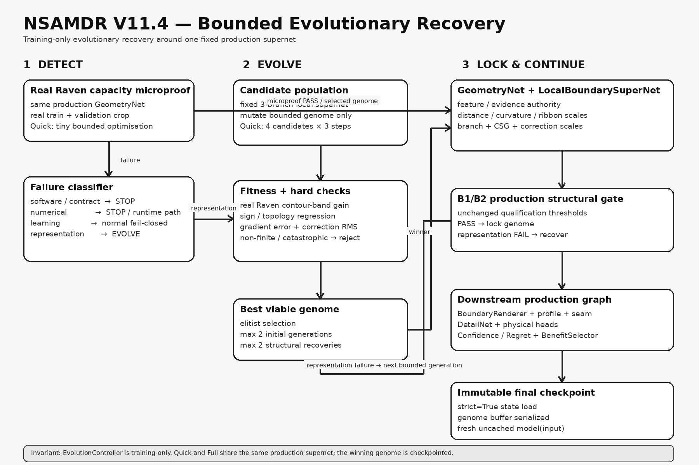

# NSAMDR production workflow

**NSAMDR** stands for **Neural Structure-Aware Material Detail Reconstruction**.
It is a learned 4x reconstruction system for authored EVE ship textures. It is
not a generic image upscaler: it reconstructs aligned physical material maps
while explicitly modelling the manufactured structure that generated them.

The active V11.4 development architecture keeps one complete production model
and adds a **training-only bounded evolutionary recovery controller** around its
local analytic boundary supernet. The controller is allowed to change a small
checkpointed genome inside the existing production topology; it is not allowed
to create a Raven-only network, bypass the production forward graph, weaken a
qualification gate, or alter inference after the final checkpoint is frozen.

## 1. Why NSAMDR exists

A conventional super-resolution network sees a low-resolution image and tries
to predict a sharper image. That is insufficient for EVE material assets. One
ship material can contain several aligned authored signals with different
physical meanings:

- albedo colour and paint detail;
- tangent-space normal relief;
- material identity and transitions;
- emissive information;
- roughness information;
- thin panel seams, circles, hatches, rings, corners, junctions, scratches, and
  small manufactured fittings.

Those features are correlated. A panel boundary reconstructed in albedo but not
in the normal or material map is physically inconsistent. A sharpening filter
can also make a blurred seam look stronger without recovering its true subpixel
position, width, continuity, or material transition.

NSAMDR therefore treats 4x reconstruction as three linked problems:

1. **recover structure** - infer continuous manufactured geometry damaged by
   downsampling;
2. **recover boundary and seam profiles** - reconstruct the physical transition
   across that geometry with one shared spatial authority;
3. **recover authored appearance detail** - restore high-frequency texture and
   relief that analytic geometry alone cannot represent.

The final candidate passes through learned confidence, regret, and benefit
selection so the production model can retain the authored baseline where a
reconstruction is unsupported.

## 2. Current production data flow

The active structural representation is a **local analytic boundary supernet**.
Each LR control location can express up to three local line/arc/ribbon branches
plus compact CSG composition. The network therefore describes many simultaneous
features across one Raven crop instead of forcing the complete tile into one
global primitive family.

```text
          authored LR physical maps + guidance
                        |
                   GeometryNet
                        |
          local analytic boundary supernet
        (3 branches + ribbon + compact CSG)
                        |
              continuous metric SDF
                        |
              deterministic boundary redraw
                        |
              BoundaryProfileSpecialist
                        |
                 PhaseAwareSeamSR
                        |
            geometry-conditioned DetailNet
                        |
              explicit 2x -> 4x decoder
                        |
         +--------------+---------------+
         |              |               |
     AlbedoHead      NormalHead     MaterialHead
         |              |               |
         +--------------+---------------+
                        |
             confidence + regret
                        |
                 BenefitSelector
                        |
             final aligned 4x maps
```

The structural path and appearance path have different jobs. Geometry owns
contour placement. The deterministic boundary renderer converts that geometry
into a physical transition. Profile and seam specialists refine shared
boundary/seam behaviour. `DetailNet` restores non-parametric high-frequency
appearance without being allowed to move the accepted contour.

The canonical deployable call remains:

```python
outputs = model(inputs)
```

No evolution controller, teacher override, cached geometry, forced gate, or
alternate candidate path is accepted by production inference.

## 3. Evolutionary recovery architecture

[](./NSAMDR_EVOLUTIONARY_RECOVERY_ARCHITECTURE.png)

The diagram shows the new training control loop. The important distinction is
that `EvolutionController` sits **outside** inference. It searches bounded
settings inside one fixed production supernet, then locks the winning genome in
the model state dictionary before normal training continues.

The controller exists to replace repeated manual trial-and-error such as:

```text
train -> structural gate fails -> inspect -> hand-edit -> restart
```

with a bounded automatic loop:

```text
real Raven capacity microproof
          |
          +-- PASS --> normal production training
          |
          +-- representation failure
                  |
                  v
             mutate genome
                  |
             evaluate small population
                  |
             retain best viable candidate
                  |
             retry structural stage
                  |
          +-- PASS --> lock genome -> continue
```

### Failure classes

The controller classifies failures before it is permitted to mutate anything.

| Failure | Examples | Automatic response |
| --- | --- | --- |
| **Software / contract** | missing attribute, bad tensor shape, failed strict interface, import error | **STOP.** Preserve traceback. No evolution. |
| **Numerical** | NaN, non-finite loss, CUDA OOM | **STOP / runtime recovery path.** Architecture evolution is not used to hide the error. |
| **Learning** | finite model, structurally valid representation, weak optimisation/generalisation | ordinary bounded training failure; no architecture mutation by default |
| **Representation** | topology regression, missing contours, negative structural gain, catastrophic structural mismatch | bounded evolutionary recovery is allowed |

A software exception is never interpreted as evidence that the neural
architecture needs another branch or different geometry authority.

## 4. The production genome

Evolution does not perform unrestricted neural architecture search. The
production topology is fixed and state-dict compatible. The bounded genome
controls only authorities already present in that topology:

```text
feature_gain
physical-evidence_gain
distance_scale
curvature_scale
ribbon_scale
extra_branch_gain
csg_logit_scale
correction_scale
```

Each field has a hard numeric range. Mutation cannot add a new network, remove
physical heads, create an inference-only path, or change output semantics.

The active genome is stored as the persistent buffer:

```text
geometry_net.production_structure.evolution_genome
```

Therefore a final checkpoint contains the exact winning genome and remains
self-contained under `strict=True` loading.

A repository-level copy of the last structurally-qualified genome is also kept
under:

```text
artifacts/nsamdr/evolution/locked_local_boundary_genome.json
```

That file seeds subsequent Quick/Full training runs. The checkpoint remains the
authoritative inference artifact.

## 5. Real Raven capacity microproof

Before expensive training, the controller evaluates a very small population on
real Raven data. Quick uses four candidates and three tiny optimisation steps per
candidate. If no candidate passes, a second bounded generation is bred around
the best survivor. If that also fails, the experiment stops **before** expensive
training.

The microproof trains only the real production structural module and scores:

- contour-band metric SDF error versus the real HR Raven target;
- improvement relative to the observable LR source SDF;
- sign/topology regression in a confident contour band;
- local SDF gradient error;
- correction magnitude;
- whether a few optimisation steps actually reduce the structural objective;
- finite numerical behaviour.

Synthetic line/circle/ring tests remain permanent structural sanity tests, but
a candidate is not considered useful merely because it solves synthetic proof
cases. Real Raven structure participates directly in evolutionary fitness.

## 6. Self-recovery after the structural gate

The normal B1/B2 production gate is still authoritative. If it passes, the
candidate genome is locked and downstream training continues.

If it fails specifically as a **representation failure**, V11.4 may perform up
to two bounded recoveries:

1. archive the failed structural state under the experiment's `evolution/`
   directory;
2. breed a new small population around the current best genome;
3. run the real-Raven capacity microproof;
4. if a viable genome appears, reset only the in-progress structural training
   state;
5. restart B1/B2 from the deterministic production seed with the new genome;
6. continue automatically only when the unchanged production gate passes.

No seam/detail/selector stage is allowed to run before structural qualification.
If bounded recovery cannot produce a viable candidate, the experiment fails
closed instead of becoming an unbounded architecture search.

## 7. Raven Quick versus Full Training

`Raven Quick` and `Full Training` instantiate the same model class, schema,
module graph, physical heads, forward path, loss definitions, and final
qualification.

Quick differs only in work budget and Raven dataset scope. The evolutionary
controller searches **inside the same production supernet**. Once the structural
gate passes, the genome is locked and reused by subsequent production training.
There is no Raven-only output head, candidate network, inference branch, or
checkpoint format.

Quick currently uses a deliberately small evolutionary budget:

```text
population            4
micro steps/candidate  3
initial generations    max 2
structural recoveries  max 2
```

Full may use a slightly larger microproof population/work budget, but not a
different production topology.

## 8. Training stages

The pass-driven production order is:

1. **evolution capacity microproof** - training-only, real Raven, fixed
   production supernet;
2. **B1 local analytic geometry + B2 same-renderer redraw**;
3. **B3 forced-authority seam reconstruction**;
4. **B4 learned seam authority**;
5. **boundary/profile proof**;
6. **geometry-conditioned physical detail**;
7. **BenefitSelector / physical fine-tuning**;
8. immutable checkpoint qualification.

The retired whole-tile seven-way primitive classifier remains only for source
compatibility where required by older code. It has no structural authority in
V11.4 and is never used to decide what one entire Raven tile "is".

## 9. Qualification gates

Evolution never weakens qualification. An experiment is not previewable until:

- architecture preflight observes every required production component in a
  direct `model(input)` call;
- the local structural representation records finite gradients and parameter
  updates during its stage;
- contour gain, topology, missing-contour, jitter, roughness, redraw, profile,
  seam, detail and selector requirements pass their existing production gates;
- the complete selected state dictionary strict-loads into the production model;
- checkpoint schema equals the active `MODEL_SCHEMA`;
- a fresh uncached `model.eval(); model(input)` completes with no overrides;
- all required output maps are finite and 4x sized;
- immutable checkpoint provenance and SHA-256 checks succeed.

Evolutionary candidate scores are discovery evidence only. They cannot replace
the normal B1/B2 gate or final architecture qualification.

## 10. Evolution evidence

Each experiment records evolutionary evidence below:

```text
artifacts/nsamdr/experiments/EXP_####/evolution/
├── generation_00_recovery_00.json
├── generation_01_recovery_00.json
├── candidate_genome.json
├── failed_structural_attempt_01/
├── failed_structural_attempt_02/
└── locked_genome.json
```

Candidate records contain:

- complete genome values and SHA-256 fingerprint;
- train micro-loss before/after;
- source and predicted contour-band MAE;
- relative structural gain;
- sign regression;
- gradient error;
- correction RMS;
- fitness;
- elapsed candidate time;
- finite/pass/failure status.

This makes self-adjustment inspectable rather than opaque.

## 11. Checkpoint and provenance contract

There is still one final checkpoint for an experiment:

```text
checkpoints/final/nsamdr_v9_fidelity.pt
```

The final checkpoint contains:

- complete production model weights;
- the local analytic structural supernet;
- the persistent locked evolution genome;
- seam/profile/detail/physical-head/selector state.

The evolutionary controller itself is Python training orchestration and is not
serialized as an inference module.

The final workflow still strict-loads that checkpoint, executes a fresh direct
production forward, hashes the immutable bytes, and binds generated preview maps
to the same full SHA-256.

## 12. Renderer behaviour

The native preview remains exactly two panes:

- **A RAW SOURCE**
- **B NSAMDR FINAL**

Both panes use the same mesh, camera, shader path, anisotropic sampler, LOD bias,
and render settings. B samples physical maps generated from the immutable final
checkpoint. There is no candidate-only cleanup or post-model repair.

Real EVE material compatibility remains deliberate. `ShaderFamily::LegacyPgs`
parsing and authored channel/roughness semantics are source-format compatibility,
not an obsolete NSAMDR baseline mode.

## 13. Commands

From the repository root:

```bat
scripts\build\run_nsamdr_v9_gui.bat
```

or:

```bat
scripts\build\nsamdr.bat gui
```

Raven Quick:

```bat
scripts\build\nsamdr.bat raven-quick
```

Full production training:

```bat
scripts\build\nsamdr.bat full-train
```

Preview a qualified experiment:

```bat
scripts\build\nsamdr.bat preview EXP_####
```

Validate before a new cycle:

```bat
scripts\build\nsamdr.bat validate
scripts\build\nsamdr.bat test contract
scripts\build\nsamdr.bat test architecture --device cpu
```

V11.4 evolutionary contract tests:

```bat
artifacts\nsamdr\python-env\Scripts\python.exe -m pytest ^
  tools\nsamdr\tests\test_evolutionary_recovery_v114_contract.py ^
  tools\nsamdr\tests\test_raven_evolution_workflow_v114.py -q
```

## 14. Troubleshooting

### Software or architecture preflight failure

Do not let evolution run. Capture the exception/traceback and fix the software
contract. Evolution is intentionally restricted to finite representation
failures.

### Evolution microproof rejects all candidates

Inspect `evolution/generation_*.json`. If every candidate is non-finite, this is
numerical/software territory. If candidates are finite but none learns or all
regress against the source SDF, the current local-boundary supernet itself may
need an explicit new capability rather than a larger search budget.

Do not simply increase Quick to dozens of generations.

### B1/B2 fails and self-recovery starts

The failed stage is archived before reset. Recovery changes only the bounded
genome and restarts B1/B2 from the deterministic seed. Downstream stages remain
blocked until the normal structural gate passes.

### Strict checkpoint load fails

Do not preview. In V11.4 the evolution genome is part of the state dictionary;
missing or mismatched genome buffers are a real checkpoint-schema failure.

## 15. Non-negotiable invariant

> Raven Quick uses the complete production NSAMDR model.
> Evolution searches bounded authorities inside that same production supernet;
> it never substitutes an alternate Raven network or a different inference path.

After structural qualification, the winning genome is locked in the checkpoint.
Final qualification remains a fresh uncached direct production forward with no
evolution controller present.
