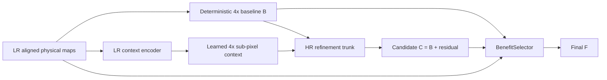

# NSAMDR production workflow

## Goal

**NSAMDR** means **Neural Structure-Aware Material Detail Reconstruction**.

The project goal is to reconstruct authored EVE ship material textures at **4x** from the
available lower-resolution authored maps while preserving the original art direction and
physical-map alignment.

The intended result is not a generic sharpen filter. NSAMDR should:

- remove interpolation blur and pixel stair-stepping;
- recover crisp manufactured seams, panel boundaries and contours;
- restore evidence-supported high-frequency hull detail;
- reconstruct aligned albedo, normal, material, emissive and roughness behaviour;
- preserve regions already reconstructed correctly by the deterministic baseline;
- avoid inventing unsupported texture content;
- fail closed to the deterministic result when the learned reconstruction is not better.

[](./EXAMPLE.png)

`EXAMPLE.png` remains the visual target: the final texture should look like a credible
higher-resolution version of the authored EVE asset, not like a sharpened low-resolution
image and not like newly invented artwork.

---

## Quick start

From the Trinity repository root:

```bat
scripts\build\nsamdr.bat gui
```

The current production-development path is **V14 HR-first SR**.

---

## 1. A / B / C / F contract

All learned reconstruction is judged relative to a deterministic 4x baseline made from
the same LR evidence.

- **A — authored target**: genuine authored high-resolution EVE pixels. Available only
  during training and qualification.
- **B — deterministic baseline**: bicubic albedo, normalized bilinear normal XY and
  nearest-neighbour material channels.
- **C — SR candidate**: learned 4x residual reconstruction over B.
- **F — final output**: local BenefitSelector result between B and C.

The production relationship is:

```text
C = B + learned HR residual
F = B + selector * (C - B)
```

A candidate is useful only when it moves B materially toward A. A selector is not allowed
to hide a fundamentally bad C and call the experiment successful.

For regions where B is already correct, final protected preservation remains:

```text
protectedPreservationRate >= 0.990
```

---

## 2. V14 production architecture

V13 proved that a candidate built primarily from an LR-grid latent representation could
be locally capable but failed representative Raven reconstruction. The final V13.3 run
reached only a tiny positive recovery and effectively zero gradient recovery. V14 is a
clean architecture replacement, not another V13 loss-weight adjustment.

The V14 production graph is:



The critical invariant is that the **residual-generating reconstruction trunk reasons in
output-resolution coordinates around B**. LR features provide context but do not directly
paint one coarse LR cell into one 4x output block.

V14 contains no production GeometryNet, spline/SDF renderer, boundary renderer, profile
specialist or seam-restoration stage.

---

## 3. Clean model ownership

The canonical production implementation lives under:

```text
tools/nsamdr/neural/v14/
```

The production package contains the model, deterministic baseline, dataset loader,
losses, trainer, qualification, checkpoint handling and tiled inference directly.

V14 does not install historical monkey-patch contracts. V9-V13 modules may remain only
as isolated legacy/source-preparation code and must not execute in the V14 production
model or trainer.

The V14 checkpoint schema is:

```text
NSAMDR_HR_FIRST_MULTI_MAP_SR_4X_V14_0
```

V13 checkpoints are intentionally incompatible.

---

## 4. Native authored resolution

Training truth must always come from the **highest genuine native authored semantic map
available**. A lower-resolution texture must never be enlarged first and then treated as
new high-resolution truth.

Examples:

```text
native 4096 asset -> supervise 1024 -> 4096
native 2048 asset -> supervise  512 -> 2048
native 1024 asset -> supervise  256 -> 1024
```

The current Raven Navy Issue SOF semantic material set used by the development workflow
is native **1024x1024**, so Raven can provide genuine `256 -> 1024` supervision but not a
genuine authored `1024 -> 4096` target.

Production still applies the learned 4x model to native Raven input:

```text
native EVE 1024 -> NSAMDR 4096
```

That final 4096 result is learned reconstruction, not supervised 4096 ground truth for
this specific Raven asset.

---

## 5. Training geometry and curriculum

V14 Quick increases spatial context from the old `32 -> 128` regime to:

```text
training crop      : 128 LR -> 512 HR
held-out crop      : 128 LR -> 512 HR
native Raven check : 256 LR -> 1024 HR when native 1K maps are available
production         : 1024 LR -> 4096 HR via tiled inference
```

The SR curriculum is deliberately split by task:

1. **clean SR** — mathematically defined area reduction teaches the 4x inverse problem;
2. **robust SR** — only after clean reconstruction is being learned, mild EVE-like blur,
   quantisation and chroma/normal damage are introduced;
3. **BenefitSelector** — trained only if C passes candidate qualification.

This separation exists so a failed SR architecture cannot be obscured by aggressive
synthetic corruption.

---

## 6. Candidate objective

Candidate C is trained to reconstruct authored truth directly. V14 uses a small set of
non-overlapping objectives:

- direct albedo reconstruction;
- gradient and Laplacian/high-frequency reconstruction;
- multiscale reconstruction;
- direct residual supervision against `A - B`;
- aligned normal reconstruction;
- aligned material reconstruction.

There is no stacked candidate-preservation penalty whose easiest solution is `C ~= B`.
Already-correct regions naturally have `A - B ~= 0`; direct residual supervision teaches
zero correction there. Hard final safety remains the BenefitSelector's responsibility.

---

## 7. Pixelation / LR-lattice rejection

Blockiness is a qualification failure, not a weight that is repeatedly tuned until a run
looks acceptable.

V14 compares how strongly `C - B` is explained by a cell-constant 4x projection against
the same measurement for the true residual `A - B`. A candidate that is materially more
LR-cell-like than the authored correction is rejected even if average L1 moves slightly
toward A.

Every training epoch publishes an explicit contact sheet:

```text
A AUTHORED | B BASELINE | C V14 SR | F SELECTED
```

with the real LR/HR dimensions recorded in the live-preview metadata.

---

## 8. Qualification

Candidate qualification remains demanding and baseline-relative:

| Requirement | Threshold |
| --- | ---: |
| Median candidate edge recovery | >= 60% |
| Median candidate global recovery | >= 45% |
| Median candidate gradient recovery | >= 35% |
| Positive-edge patch fraction | >= 75% |
| Positive-global patch fraction | >= 75% |
| Median normal recovery | >= 0% |
| Median material recovery | >= 0% |
| Worst candidate recovery | >= -10% |
| Max excess LR-lattice cell projection vs authored residual | <= 15% |

Only after C passes does the selector train.

Final qualification additionally requires:

| Requirement | Threshold |
| --- | ---: |
| Selector edge retention | >= 90% |
| Selector global retention | >= 90% |
| Protected-B preservation | >= 99% |
| Worst final recovery | >= -10% |

A catastrophic patch can reject an otherwise good median result.

---

## 9. Quick and Full invariant

Raven Quick and Full Training must use the same:

- V14 production model;
- module graph;
- 4x baseline;
- candidate objective;
- selector behaviour;
- tiled inference implementation;
- checkpoint schema;
- qualification/provenance contract.

They may differ only in work budget and dataset scale.

Full Training remains disabled until Raven V14 candidate qualification passes. Once the
architecture is proven, Full should preferentially use the highest-native-resolution EVE
semantic families available, especially genuine 4K families that directly supervise the
production `1024 -> 4096` task.

---

## 10. Checkpoint and provenance

A qualified V14 experiment promotes exactly one checkpoint to:

```text
checkpoints/final/nsamdr_v14.pt
```

The final manifest records its full SHA-256 and schema. The checkpoint must strict-load
into a fresh `NSAMDRV14` instance before preview/baking.

No post-model repair, hidden sharpening or candidate cleanup is permitted.

---

## 11. Production inference

Production 4K output uses tiled inference so the HR-first trunk does not require a full
4096 feature tensor in memory at once. Overlapping LR tiles are reconstructed at 4x and
blended in output space.

For Raven this is:

```text
1024 native LR physical maps
        -> overlapping 128 LR tiles
        -> V14 512 HR tile reconstruction
        -> overlap blend
        -> 4096 final physical maps
```

The same model call and weights are used in Quick, qualification and production.

---

## 12. Commands

Run from the repository root.

```bat
scripts\build\nsamdr.bat gui
scripts\build\nsamdr.bat raven-quick
scripts\build\nsamdr.bat preview EXP_####
scripts\build\nsamdr.bat validate
```

Historical V9-named Python entry-point filenames may remain temporarily as **thin command
compatibility shims** so the batch/GUI surface does not change. They must delegate directly
to V14 and contain no old training/model implementation.

---

## 13. Completion condition

The project is not complete because a metric is green or because a selector can hide a
bad candidate.

The ultimate acceptance criterion remains visual:

> **Given representative held-out EVE authored textures, NSAMDR FINAL must look
> materially closer to the authored high-resolution target than deterministic 4x B,
> while preserving already-correct regions and aligned physical-map behaviour.**

The first V14 milestone is therefore narrow and falsifiable:

```text
prove that HR-first candidate C materially beats B on held-out Raven reconstruction
```

If it cannot, reassess the SR architecture rather than repeatedly adjusting constants.
