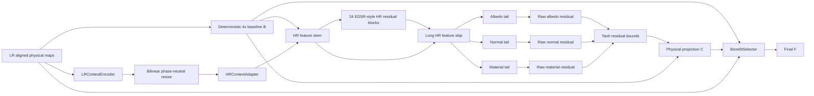

# NSAMDR production workflow

## Goal

**NSAMDR** means **Neural Structure-Aware Material Detail Reconstruction**.

The system reconstructs EVE ship material textures at **4x** from lower-resolution authored maps.
The output must preserve authored structure and physical-map alignment.

NSAMDR must:

- remove interpolation blur and pixel stair-stepping;
- recover manufactured seams, panel boundaries, contours, and supported high-frequency detail;
- reconstruct aligned albedo, normal, and material behaviour;
- preserve regions where the deterministic reconstruction is already correct;
- avoid unsupported texture invention;
- fall back to the deterministic result when the learned result is worse.

[](./EXAMPLE.png)

`EXAMPLE.png` is the visual target.

---

## Quick start

From the Trinity repository root:

```bat
scripts\build\nsamdr.bat gui
```

The active development model is **V15.0**.

---

## 1. A / B / C / F contract

- **A — authored target**: genuine authored HR EVE pixels. A is training and qualification truth.
- **B — deterministic baseline**: bicubic albedo, normalized bilinear normal XY, and nearest-neighbour material channels.
- **C — SR candidate**: learned HR residual reconstruction over B.
- **F — final output**: local BenefitSelector result between B and C.

The production relationship is:

```text
C = project(B + predicted residual)
F = B + selector * (C - B)
```

C must materially improve B before the selector can train.

---

## 2. Why V15.0 exists

### V14.1 result

V14.1 removed the PixelShuffle path and used phase-neutral LR context.
It completed Capacity without numerical collapse.

Its final Capacity result was:

```text
global recovery   = 53.00%   PASS
gradient recovery = 46.15%   PASS
edge recovery     = 58.02%   FAIL, required 60%
lattice excess    =  7.0%    PASS
```

This showed that the phase-neutral single-resolution HR path was stable and close to the required reconstruction capacity.

### V14.2 to V14.4 result

V14.2 introduced a custom multi-scale HR encoder/decoder with RCAN-style blocks.
V14.3 and V14.4 added more stabilization around that topology.

All three revisions diverged during Capacity.
The raw residuals grew rapidly and the candidate saturated.

V14.4 still diverged after these changes:

```text
learning rate          0.0002
ResidualGroup scale    0.10
straight-through clamp enabled
identity-safe residual initialization enabled
```

The repeated failure rejected the multi-scale V14 branch.

### V15.0 decision

V15.0 returns to the stable V14.1 spatial topology and increases capacity with a conventional single-resolution residual network.

The design follows the conservative parts of established SR architectures:

- EDSR-style `Conv -> ReLU -> Conv` residual blocks;
- no batch normalization;
- residual scaling;
- one long feature skip;
- Adam optimization for candidate SR;
- no feature-space encoder/decoder pyramid;
- no PixelShuffle in the learned candidate path;
- no transposed convolution;
- no adversarial or perceptual hallucination objective.

This is an adaptation of established SR practice to the NSAMDR requirement that learned reconstruction occurs around deterministic HR baseline B.

---

## 3. V15.0 architecture

### 3.1 Top-level graph



### 3.2 Candidate backbone

```text
B physical maps + HR context
            |
            v
      3x3 HR feature stem
          64 channels
            |
            +----------------------------- long skip
            |
            v
      24 residual blocks

Each block:

input
  |
  +-------------------------+
  |                         |
  v                         |
3x3 convolution             |
ReLU                        |
3x3 convolution             |
residual scale = 0.10       |
  |                         |
  +---------- add ----------+

No BatchNorm.
No change of spatial resolution.
No channel attention.
No feature pyramid.
No decoder.
            |
            v
       3x3 body tail
            |
            +------ add long skip
            |
            v
      shared HR features
       /       |       \
      v        v        v
  albedo    normal   material
   tail      tail      tail
 2 blocks   2 blocks   2 blocks
    |          |          |
 ZeroHead   ZeroHead   ZeroHead
```

The three `ZeroHead` layers guarantee:

```text
before training:
C == B
```

### 3.3 Phase-neutral context

LR physical maps are encoded at LR.
The context features move to HR with bilinear interpolation.
A normal 3x3 HR convolution adapts the resized context.

The LR path does not create 4x phase channels.

Forbidden learned paths are:

```text
PixelShuffle
ConvTranspose2d
learned 4x phase tensors
multi-scale HR encoder/decoder
```

### 3.4 Residual output

Each map tail predicts a raw residual.
V15.0 applies:

```text
predicted residual = tanh(raw) * residualCap
```

The caps remain:

```text
albedo   = 0.40
normal   = 0.20
material = 0.25
```

Physical projection is:

```text
albedo C   = clamp(B + predicted residual, 0, 1)
normal C   = normalize_xy(B + predicted residual)
material C = clamp(B + predicted residual, 0, 1)
```

The direct residual loss supervises the bounded residual before physical projection.

---

## 4. Literature alignment

V15.0 deliberately reduces custom architecture.

The relevant design references are:

- **EDSR, Lim et al., CVPR Workshops 2017**: remove BatchNorm from SR residual blocks, use `Conv -> ReLU -> Conv`, and use residual scaling for large residual networks.
- **RCAN, Zhang et al., ECCV 2018**: use residual-in-residual skip structure and channel attention to focus capacity on high-frequency reconstruction.
- **SwinIR, Liang et al., ICCV Workshops 2021**: separate shallow feature extraction, deep feature extraction, and reconstruction with strong residual organization.

V15.0 uses the simpler EDSR direction first.
It does not add RCAN attention or Swin Transformer blocks until a simpler stable residual model proves insufficient.

NSAMDR still differs from standard SISR in one important way:

> The network reconstructs a residual around deterministic HR baseline B and uses aligned physical maps, instead of reconstructing RGB directly from LR and then owning every output pixel.

That difference is intentional.

---

## 5. OOP ownership

The active implementation remains under:

```text
tools/nsamdr/neural/v14/
```

The package path is retained for compatibility with the existing workflow.
The checkpoint schema, GUI, diagnostic revision, and architecture contract identify the active model as V15.0.

### `config.py`

`V15Config` owns the V15 architecture and training configuration.
`V14Config` is a compatibility alias only.

Model schema:

```text
NSAMDR_HR_FIRST_MULTI_MAP_SR_4X_V15_0
```

### `refinement.py`

Owns:

```text
ZeroHead
EDSRResidualBlock
CheckpointedResidualBody
PhysicalMapTail
SingleScaleHRRefinementTrunk
```

### `model.py`

Owns:

```text
LRContextEncoder
HRContextAdapter
SingleScaleHRRefinementTrunk
BenefitSelector
NSAMDRV15
```

`NSAMDRV14` is a compatibility alias only.

### `capacity_diagnostic.py`

Owns the non-promotable single-region Capacity proof.
It uses the exact V15.0 candidate path.

---

## 6. Capacity test

Capacity uses:

```text
training pair       128 LR -> 512 authored HR
maximum steps       3072
learning rate       0.0002
optimizer           Adam
```

Pass criteria remain unchanged:

```text
global recovery   >= 45%
edge recovery     >= 60%
gradient recovery >= 35%
lattice excess    <= 15%
```

The test still has three outcomes:

```text
PASS
FAIL
DIVERGED
```

A `DIVERGED` result is not a Capacity result.

---

## 7. Candidate objective

The current objective remains unchanged for the V15.0 architecture test.

It contains:

- albedo L1 reconstruction;
- gradient reconstruction;
- Laplacian reconstruction;
- multi-scale pooled reconstruction;
- direct bounded residual supervision against `A - B`;
- normal reconstruction;
- material reconstruction.

The objective is intentionally unchanged so the Capacity result isolates the architecture change.

If V15.0 remains stable but fails Capacity, the next model comparison must use the same objective and the same qualification gates.

---

## 8. Diagnostic ladder

```text
1. V15.0 HR Residual Capacity
       |
       v
2. V15.0 Multi-Region SR Mini
       |
       v
3. V15.0 Selector Retention Mini
       |
       v
4. V15.0 Raven Quick
       |
       v
5. Full Training
       |
       v
6. Qualified V15.0 Preview
```

Do not proceed to Multi-Region until Capacity returns `PASS`.

---

## 9. Native authored resolution

Training truth must use genuine authored resolution.

Examples:

```text
native 4096 asset -> supervise 1024 -> 4096
native 2048 asset -> supervise  512 -> 2048
native 1024 asset -> supervise  256 -> 1024
```

Raven is native 1024.
It can provide genuine `256 -> 1024` supervision.
It cannot create genuine `1024 -> 4096` truth.

Raven is the architecture proving ground.
The production corpus must later include genuinely native 2K and 4K material families.

---

## 10. Qualification

Candidate qualification remains:

| Requirement | Threshold |
| --- | ---: |
| Independent held-out samples | >= 4 |
| Median candidate edge recovery | >= 60% |
| Median candidate global recovery | >= 45% |
| Median candidate gradient recovery | >= 35% |
| Positive-edge patch fraction | >= 75% |
| Positive-global patch fraction | >= 75% |
| Median normal recovery | >= 0% |
| Median material recovery | >= 0% |
| Worst candidate recovery | >= -10% |
| Max excess LR-lattice cell projection | <= 15% |

Only after C passes does BenefitSelector train.

Final qualification remains:

| Requirement | Threshold |
| --- | ---: |
| Selector edge retention | >= 90% |
| Selector global retention | >= 90% |
| Median final normal recovery | >= 0% |
| Median final material recovery | >= 0% |
| Protected-B preservation | >= 99% |
| Worst final recovery | >= -10% |
| Max excess LR-lattice cell projection | <= 15% |

---

## 11. Current decision rule

For the next V15.0 Capacity run:

```text
PASS
-> freeze V15.0 candidate architecture
-> continue to Multi-Region

stable FAIL
-> V15.0 lacks sufficient reconstruction capacity
-> compare a stronger literature-backed model family

DIVERGED
-> stop
-> inspect the numerical failure before any further qualification run
```

Do not relax the gates.
Do not increase the step budget to convert a failure into a pass.
